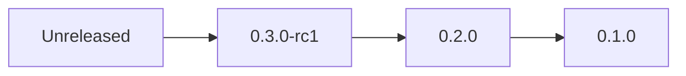

# Changelog

All notable changes to gormauthstore are documented in this file.

The format is based on [Keep a Changelog](https://keepachangelog.com/en/1.1.0/),
and this project adheres to [Semantic Versioning](https://semver.org/spec/v2.0.0.html).

## [Unreleased]

### Added

- **Context support:** All AuthStore methods now have `*WithContext()` variants
  accepting `context.Context` for timeout and cancellation control
  - `FindIdentityWithContext(ctx, idk)`
  - `SaveIdentityWithContext(ctx, identity)`
  - `DeleteIdentityWithContext(ctx, idk)`
  - `FindIdentitySecureWithContext(ctx, idk)`
  - `AutoMigrateWithContext(ctx)`
- **Production deployment guide** (`docs/PRODUCTION.md`): database
  configuration, connection pools, TLS, timeouts, security checklist
- **Migration guide** (`docs/UPGRADE_FROM_V0.md`): step-by-step upgrade
  from v0.x (GORM v1) to v1.0.0 (GORM v2)
- 13 context support tests (CTX-001 to CTX-013)

## [0.3.0-rc1] - 2026-02-07

### Added

- **Comprehensive test suite:** 77 tests across 5 test files
  - 27 unit tests (TC-001 to TC-027)
  - 13 security tests (SEC-001 to SEC-013)
  - 10 integration tests (build-tag gated)
  - 6 benchmarks (PERF-001 to PERF-006)
- **Test infrastructure:** `testIdentityBuilder` pattern, `newTestStore`,
  `seedIdentity` helpers
- **CI coverage gate:** 70% minimum enforced in GitHub Actions

## [0.2.0] - 2026-02-06

### Changed

- **GORM v2 migration:** Replaced deprecated `github.com/jinzhu/gorm` v1.9.16
  with `gorm.io/gorm` v1.31.1
- **Database drivers:** Upgraded to latest GORM v2 driver packages
  - `gorm.io/driver/postgres` v1.5.9
  - `gorm.io/driver/mysql` v1.5.7
  - `gorm.io/driver/sqlite` v1.6.0
  - `gorm.io/driver/sqlserver` v1.5.3
- **Dependency updates:**
  - `github.com/lib/pq` v1.10.9
  - `github.com/mattn/go-sqlite3` v1.14.33
  - `golang.org/x/crypto` v0.47.0
  - `golang.org/x/image` v0.35.0
  - `golang.org/x/text` v0.33.0
- **Error handling:** `gorm.IsRecordNotFoundError()` replaced with
  `errors.Is(err, gorm.ErrRecordNotFound)`
- **Connection API:** `gorm.Open("dialect", dsn)` replaced with
  `gorm.Open(driver.Open(dsn), &gorm.Config{})`

### Added

- **Internal `identityRecord` model:** Provides GORM v2 tags for the upstream
  `SqrlIdentity` struct (which uses legacy GORM v1 `sql:""` tags)
- **Input validation:** `ValidateIdk()` integrated into `FindIdentity`,
  `SaveIdentity`, and `DeleteIdentity`
- **Sentinel errors:** `ErrEmptyIdentityKey`, `ErrIdentityKeyTooLong`,
  `ErrInvalidIdentityKeyFormat`, `ErrNilIdentity`, `ErrNilDatabase`,
  `ErrWrappedIdentityDestroyed`
- **Secure memory clearing:**
  - `WipeBytes()` -- platform-aware byte slice clearing (Unix/Windows)
  - `WipeString()` -- safe string reference clearing
  - `ClearIdentity()` -- wipes all sensitive fields from `SqrlIdentity`
  - `ScrambleBytes()` -- overwrites with pseudo-random data
  - `SecureIdentityWrapper` -- RAII-style auto-cleanup wrapper
- **`FindIdentitySecure()`** -- returns `SecureIdentityWrapper` for
  automatic cryptographic material cleanup
- **CI/CD pipeline:** GitHub Actions with lint, security scan (gosec),
  coverage gate, and build matrix
- **Makefile:** `make ci`, `make test`, `make lint`, `make security`
- **Comprehensive documentation:** 10+ documents covering architecture,
  requirements, API specification, test specifications, and dependencies

### Security

- gosec scan clean (0 issues)
- 13 security tests covering SQL injection, DoS, unicode handling
- Secure memory clearing for cryptographic keys (Suk, Vuk)
- Input validation prevents injection and DoS via oversized keys

### Breaking Changes

- **Go version:** Minimum Go 1.24 (was 1.13)
- **GORM version:** Requires `gorm.io/gorm` v2 (not compatible with
  `github.com/jinzhu/gorm` v1)
- **Connection API:** `gorm.Open()` signature changed (see migration guide)

## [0.1.0] - 2025-11-18

### Added

- Initial implementation of `ssp.AuthStore` interface
- `FindIdentity`, `SaveIdentity`, `DeleteIdentity` methods
- `AutoMigrate` for automatic table creation
- `NewAuthStore(db)` constructor
- Basic CRUD test
