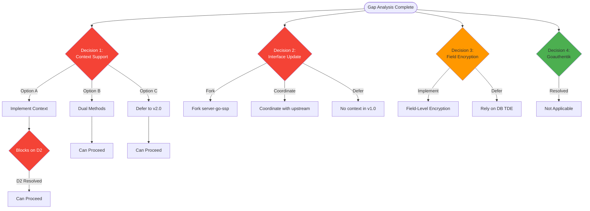
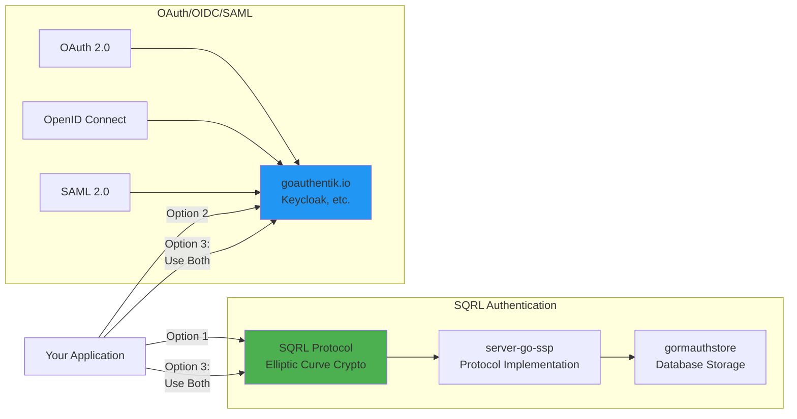

# Gap Analysis and Decision Prompts
## Critical Decisions Requiring User Input

**Version:** 1.0
**Date:** November 18, 2025
**Status:** Awaiting User Decisions
**Priority:** CRITICAL - Blocks v1.0.0 Release

---

## Table of Contents

1. [Executive Summary](#executive-summary)
2. [Critical Gaps Identified](#critical-gaps-identified)
3. [Decision Prompts](#decision-prompts)
4. [Technical Trade-offs](#technical-trade-offs)
5. [Recommendations](#recommendations)
6. [Next Steps](#next-steps)

---

## Executive Summary

### Analysis Completed

This document summarizes gaps, conflicts, and ambiguities identified during the comprehensive code review and architecture analysis. **4 critical decisions** require user input before proceeding with the upgrade plan.

### Impact Summary

| Decision | Impact on Timeline | Impact on v1.0.0 | Urgency |
|----------|-------------------|------------------|---------|
| **Context Support** | +2-3 hours | Production readiness | **CRITICAL** |
| **Interface Coordination** | +1 week (if fork needed) | Potential blocker | **CRITICAL** |
| **Field Encryption** | +8-12 hours (if now) | Optional feature | MEDIUM |
| **Goauthentik Integration** | N/A (not applicable) | Resolved | LOW |

### Status Dashboard



---

## Critical Gaps Identified

### Gap 1: Modern Go Context Support (CRITICAL)

**Description:**
Current implementation lacks `context.Context` parameter on all methods, which is standard practice in modern Go for:
- Request cancellation
- Timeout enforcement
- Distributed tracing
- Request-scoped values

**Impact:**
- ❌ Cannot enforce database query timeouts
- ❌ Cannot cancel long-running operations
- ❌ Not production-ready for high-scale deployments
- ❌ Incompatible with modern Go middleware

**Current Code:**
```go
func (as *AuthStore) FindIdentity(idk string) (*ssp.SqrlIdentity, error)
```

**Expected Modern Pattern:**
```go
func (as *AuthStore) FindIdentity(ctx context.Context, idk string) (*ssp.SqrlIdentity, error)
```

**Severity:** **CRITICAL**
**Resolution:** **Decision Point 1 (see below)**

---

### Gap 2: Interface Dependency Constraint (CRITICAL)

**Description:**
This library implements `ssp.AuthStore` interface defined in `github.com/sqrldev/server-go-ssp`. If we add context.Context to our methods, we must also update the upstream interface definition.

**Dependency Chain:**
```
server-go-ssp-gormauthstore (this repo)
  ↓ implements
ssp.AuthStore interface
  ↓ defined in
github.com/sqrldev/server-go-ssp
```

**Constraint:**
- ✅ We control: `server-go-ssp-gormauthstore` implementation
- ❌ We DON'T control: `ssp.AuthStore` interface definition (upstream)
- ⚠️ Uncertain: Coordination with upstream maintainer

**Implications:**

| Scenario | Action Required | Estimated Effort |
|----------|----------------|------------------|
| **Upstream cooperative** | Submit PR to server-go-ssp | 1-2 days (review time) |
| **Upstream unresponsive** | Fork server-go-ssp | 1 week (maintenance burden) |
| **Upstream rejects** | Abandon context support | 0 hours (but v1.0 incomplete) |

**Severity:** **CRITICAL**
**Resolution:** **Decision Point 2 (see below)**

---

### Gap 3: Test Coverage Below Target (HIGH)

**Description:**
Current test coverage is ~30%, with only 1 integration test. Target is ≥70% for v1.0.0 release.

**Current State:**
- auth_store.go: ~25% coverage
- secure_memory_*.go: ~90% coverage (✅ Good)
- errors.go: ~100% coverage (✅ Good)

**Gap:** **+40% coverage needed**

**Required Work:**
- +70 test cases (see `API_TESTS_SPEC.md`)
- +12 hours estimated effort
- Already planned in TASK-028 to TASK-034

**Severity:** **HIGH**
**Resolution:** **Already addressed in UNIFIED_TODO.md (Phase 2.2)**

---

### Gap 4: No Observability Hooks (MEDIUM)

**Description:**
No structured logging, metrics, or tracing hooks for production monitoring.

**Missing Capabilities:**
- Query latency metrics
- Error rate tracking
- Audit logging (who accessed what identity)
- Distributed tracing integration

**Impact:**
- ⚠️ Difficult to debug production issues
- ⚠️ No performance monitoring
- ⚠️ No audit trail for compliance

**Recommendation:**
- v1.0.0: Document as enhancement
- v1.1.0: Add observability interfaces
- Estimated effort: 6-8 hours

**Severity:** **MEDIUM**
**Resolution:** **Defer to v1.1.0 (document in backlog)**

---

### Gap 5: Field-Level Encryption Not Implemented (MEDIUM)

**Description:**
Sensitive fields (Suk, Vuk) stored as plaintext in database. Relies on database-level TDE (Transparent Data Encryption).

**Current Mitigations:**
- ✅ TLS encryption in transit
- ✅ Database TDE (deployment-specific)
- ✅ Memory clearing after use

**Enhanced Security Option:**
- Encrypt Suk/Vuk before INSERT/UPDATE
- Decrypt on SELECT
- Requires key management strategy (KMS, env vars, etc.)

**Complexity:** +8-12 hours implementation + key management design

**Severity:** **MEDIUM**
**Resolution:** **Decision Point 3 (see below)**

---

### Gap 6: No Health Check API (LOW)

**Description:**
No method to verify database connectivity health.

**Recommendation:**
```go
func (as *AuthStore) HealthCheck(ctx context.Context) error {
    sqlDB, err := as.db.DB()
    if err != nil {
        return err
    }
    return sqlDB.PingContext(ctx)
}
```

**Severity:** **LOW**
**Resolution:** **Add in v1.1.0 or as v1.0.1 patch**

---

### Gap 7: No Migration Between Database Types (LOW)

**Description:**
No helper to migrate identities from PostgreSQL → MySQL, etc.

**Use Case:** Rare (most deployments don't change database vendors)

**Severity:** **LOW**
**Resolution:** **Document workaround (SQL dump/restore), defer to v2.0**

---

## Decision Prompts

### DECISION POINT 1: Context Support (REQUIRED)

**Question:** Should we add `context.Context` support to all AuthStore methods?

---

#### Option A: Add Context Support ✅ RECOMMENDED

**Implementation:**
```go
func (as *AuthStore) FindIdentity(ctx context.Context, idk string) (*ssp.SqrlIdentity, error) {
    // Validate input
    if err := ValidateIdk(idk); err != nil {
        return nil, err
    }

    // Check context cancellation
    if err := ctx.Err(); err != nil {
        return nil, fmt.Errorf("context error: %w", err)
    }

    // Use context with GORM
    identity := &ssp.SqrlIdentity{}
    err := as.db.WithContext(ctx).Where("idk = ?", idk).First(identity).Error
    if err != nil {
        if errors.Is(err, gorm.ErrRecordNotFound) {
            return nil, ssp.ErrNotFound
        }
        return nil, err
    }
    return identity, nil
}
```

**Pros:**
- ✅ **Production-ready from day one**
- ✅ Standard Go idiom (expected by users)
- ✅ Enables request timeouts
- ✅ Supports distributed tracing
- ✅ Allows graceful cancellation
- ✅ Future-proof design

**Cons:**
- ❌ **Breaking change** (requires callers to update)
- ❌ **Depends on Decision Point 2** (interface update)
- ❌ +2-3 hours implementation time

**Example Caller Impact:**
```go
// OLD CODE (v0.x):
identity, err := store.FindIdentity("idk_value")

// NEW CODE (v1.0.0):
ctx := context.WithTimeout(context.Background(), 5*time.Second)
identity, err := store.FindIdentity(ctx, "idk_value")
```

**Migration Effort for Users:** ~5 minutes per call site

**RECOMMENDATION:** **STRONGLY RECOMMENDED FOR v1.0.0**

---

#### Option B: Add Context Methods (Backward Compatible)

**Implementation:**
```go
// New context-aware methods
func (as *AuthStore) FindIdentityContext(ctx context.Context, idk string) (*ssp.SqrlIdentity, error) {
    // ... implementation with context
}

// Existing method (deprecated)
func (as *AuthStore) FindIdentity(idk string) (*ssp.SqrlIdentity, error) {
    return as.FindIdentityContext(context.Background(), idk)
}
```

**Pros:**
- ✅ Backward compatible
- ✅ Gradual migration path
- ✅ No interface update required

**Cons:**
- ❌ API duplication (6 methods → 12 methods)
- ❌ Old methods must be marked deprecated
- ❌ Technical debt from day one
- ❌ Confusing for new users (which method to use?)

**RECOMMENDATION:** **Only if breaking changes absolutely forbidden**

---

#### Option C: Defer to v2.0.0 (No Context)

**Pros:**
- ✅ No immediate work
- ✅ Can release v1.0.0 faster

**Cons:**
- ❌ **v1.0.0 not production-ready**
- ❌ Users will demand context support immediately
- ❌ Forced to release v2.0.0 soon (breaking change)
- ❌ Reputational risk (releasing incomplete v1.0)

**RECOMMENDATION:** **STRONGLY NOT RECOMMENDED**

---

#### PROMPT FOR DECISION 1:

Please provide your decision by filling in the following:

```yaml
DECISION_1_CONTEXT_SUPPORT:
  choice: [A/B/C]  # Choose A, B, or C
  rationale: |
    [Your reasoning for this choice. Consider:
     - Production requirements
     - User expectations
     - Timeline constraints
     - Willingness to manage breaking changes]

  additional_notes: |
    [Any additional context or concerns]

  timeline_impact_acceptable: [yes/no]  # Can we accept +2-3 hours?
```

**Example Response:**
```yaml
DECISION_1_CONTEXT_SUPPORT:
  choice: A
  rationale: |
    We need v1.0.0 to be production-ready from day one.
    Context support is expected by modern Go developers.
    +2-3 hours is acceptable timeline impact.

  additional_notes: |
    Will coordinate with server-go-ssp maintainer for interface update.

  timeline_impact_acceptable: yes
```

---

### DECISION POINT 2: Interface Update Coordination (REQUIRED IF D1=A)

**Question:** How should we handle the upstream `ssp.AuthStore` interface update?

**Dependency:** Only applicable if Decision 1 = Option A

---

#### Investigation Required:

Before deciding, we need to understand:

1. **Who maintains `github.com/sqrldev/server-go-ssp`?**
   - [ ] Active maintainer (responsive)?
   - [ ] Community project (PR review time)?
   - [ ] Abandoned (no updates in >1 year)?

2. **Are there other implementations of `ssp.AuthStore`?**
   - [ ] `server-go-ssp-redishoard` (Redis-based implementation)?
   - [ ] Other third-party implementations?
   - [ ] Just this one (gormauthstore)?

3. **Is the interface versioned?**
   - [ ] Yes (can release AuthStore v2 interface)?
   - [ ] No (breaking change for all users)?

---

#### Option 2A: Coordinate with Upstream Maintainer

**Approach:**
1. Submit GitHub Issue proposing context.Context addition
2. Submit PR to `server-go-ssp` updating interface
3. Wait for review/merge
4. Update gormauthstore to use new interface
5. Version as v1.0.0

**Timeline:**
- **Best case:** 2-3 days (if maintainer responsive)
- **Typical:** 1-2 weeks (PR review)
- **Worst case:** 1 month+ (if slow response)

**Pros:**
- ✅ Proper upstream coordination
- ✅ Benefits entire SQRL ecosystem
- ✅ No fork maintenance burden

**Cons:**
- ❌ Timeline uncertainty
- ❌ Depends on third-party response
- ❌ Possible rejection

**RECOMMENDATION:** **Preferred if maintainer responsive**

---

#### Option 2B: Fork `server-go-ssp`

**Approach:**
1. Fork `github.com/sqrldev/server-go-ssp` to `github.com/dxcSithLord/server-go-ssp`
2. Update interface in fork
3. Use fork in development
4. Submit PR upstream (optional)
5. Maintain fork long-term OR merge back later

**go.mod Change:**
```go
require (
    github.com/dxcSithLord/server-go-ssp v2.0.0  // Forked version with context
)
```

**Pros:**
- ✅ Full control over timeline
- ✅ Can proceed immediately
- ✅ Can still merge upstream later

**Cons:**
- ❌ Fork maintenance burden
- ❌ Diverges from upstream
- ❌ Users must use our fork

**RECOMMENDATION:** **Fallback if Option 2A fails**

---

#### Option 2C: Abandon Context Support (Revert to D1 Option B or C)

**Approach:**
- Don't update interface
- Either:
  - Use Option B from Decision 1 (dual methods), OR
  - Use Option C from Decision 1 (defer to v2.0)

**Pros:**
- ✅ No coordination needed
- ✅ No timeline impact

**Cons:**
- ❌ v1.0.0 incomplete
- ❌ Technical debt

**RECOMMENDATION:** **Last resort**

---

#### PROMPT FOR DECISION 2:

```yaml
DECISION_2_INTERFACE_UPDATE:
  # First, complete this investigation:
  investigation:
    upstream_maintainer:
      name: [Name or "unknown"]
      last_activity: [Date of last commit]
      responsive: [yes/no/unknown]

    other_implementations:
      found: [yes/no]
      list: [List implementations or "none found"]

    interface_versioning:
      versioned: [yes/no]
      current_version: [Version or "N/A"]

  # Then choose approach:
  choice: [2A/2B/2C]

  rationale: |
    [Why did you choose this approach?]

  coordination_plan: |
    [If 2A: How will you contact maintainer? Timeline?]
    [If 2B: Will you maintain fork long-term?]
    [If 2C: How will you handle user expectations?]

  timeline_constraint: |
    [What is your hard deadline for v1.0.0 release?]
    [Can you wait for upstream review?]
```

---

### DECISION POINT 3: Field-Level Encryption (OPTIONAL)

**Question:** Should we encrypt Suk/Vuk fields in the database?

**Current Mitigation Strategy:**
- ✅ **TLS Encryption In-Transit:** Database connections use TLS (sslmode=require)
- ✅ **Transparent Data Encryption (TDE):** Database encrypts at rest (deployment-specific)
- ✅ **Memory Clearing:** WipeBytes clears sensitive data from RAM after use

**Enhanced Security Option:**
Implement field-level encryption within the application:

```go
func (as *AuthStore) SaveIdentity(identity *ssp.SqrlIdentity) error {
    // Encrypt sensitive fields before saving
    encryptedSuk, err := encrypt(identity.Suk, as.encryptionKey)
    if err != nil {
        return err
    }

    encryptedVuk, err := encrypt(identity.Vuk, as.encryptionKey)
    if err != nil {
        return err
    }

    // Save encrypted values
    dbIdentity := &dbSqrlIdentity{
        Idk: identity.Idk,
        Suk: encryptedSuk,  // Encrypted in DB
        Vuk: encryptedVuk,  // Encrypted in DB
        // ...
    }

    return as.db.Save(dbIdentity).Error
}
```

---

#### Option 3A: Implement Field-Level Encryption

**Requirements:**
1. Choose encryption algorithm (AES-256-GCM recommended)
2. Key management strategy:
   - Environment variable (`SQRL_ENCRYPTION_KEY`)
   - KMS integration (AWS KMS, Google Cloud KMS)
   - HashiCorp Vault
3. Key rotation support
4. Migration script (encrypt existing data)

**Estimated Effort:** 8-12 hours

**Pros:**
- ✅ Defense-in-depth (multiple encryption layers)
- ✅ Protection if database backup compromised
- ✅ Compliance advantage (GDPR, HIPAA)

**Cons:**
- ❌ Complexity (key management)
- ❌ Performance impact (encrypt/decrypt on every query)
- ❌ Operational overhead (key rotation, backup)
- ❌ Breaks database-level search/indexing on Suk/Vuk

**RECOMMENDATION:** **Defer to v1.1.0 unless compliance requires**

---

#### Option 3B: Defer to v1.1.0 (Rely on DB TDE)

**Approach:**
- Document TDE requirement in PRODUCTION.md
- Provide example connection strings with TLS
- Add field-level encryption in v1.1.0 if demanded

**Pros:**
- ✅ Simpler v1.0.0 release
- ✅ No key management complexity
- ✅ TDE is industry-standard practice

**Cons:**
- ❌ Less defense-in-depth
- ❌ Compliance auditors may request application-level encryption

**RECOMMENDATION:** **Recommended for v1.0.0**

---

#### PROMPT FOR DECISION 3:

```yaml
DECISION_3_FIELD_ENCRYPTION:
  choice: [3A/3B]

  rationale: |
    [Consider:
     - Compliance requirements (GDPR, HIPAA, PCI-DSS)
     - Threat model (is DB compromise a risk?)
     - Operational capability (can you manage encryption keys?)]

  if_3A_chosen:
    key_management_strategy: [env_var/kms/vault/other]
    kms_provider: [aws/gcp/azure/none]
    timeline_acceptable: [yes/no]  # Can accept +8-12 hours?

  if_3B_chosen:
    tde_requirement_documented: [yes]
    tde_verification_plan: |
      [How will you ensure deployments use TDE?]
```

---

### DECISION POINT 4: Goauthentik.io Integration (RESOLVED)

**Question:** Should this library integrate with goauthentik.io or other IAM systems?

**Analysis:**



**Findings:**
- ✅ SQRL and goauthentik serve **different use cases**
- ✅ SQRL: Passwordless, QR-code based, privacy-preserving
- ✅ goauthentik: Federation, SSO, enterprise directory integration
- ✅ They are **complementary**, not competing
- ✅ Applications can support **both** authentication methods

**Conclusion:**
**NO INTEGRATION NEEDED** - This library is SQRL-specific and should remain focused.

**Recommendation:**
- Document in README that SQRL can coexist with OAuth/OIDC
- Provide example of app supporting both SQRL + goauthentik

**Status:** ✅ **RESOLVED** - No action required

---

## Technical Trade-offs

### Trade-off Matrix

| Decision | Option | Short-Term Cost | Long-Term Benefit | Risk |
|----------|--------|----------------|-------------------|------|
| **D1: Context** | Option A | +3h, breaking change | Production-ready v1.0 | LOW |
| **D1: Context** | Option B | +2h, API duplication | Backward compat | MEDIUM |
| **D1: Context** | Option C | 0h | Technical debt | HIGH |
| **D2: Interface** | Option 2A | 1-2 weeks wait | Proper coordination | MEDIUM |
| **D2: Interface** | Option 2B | Fork maintenance | Full control | MEDIUM |
| **D2: Interface** | Option 2C | 0h | Incomplete v1.0 | HIGH |
| **D3: Encryption** | Option 3A | +10h, ops complexity | Enhanced security | MEDIUM |
| **D3: Encryption** | Option 3B | 0h | Standard practice | LOW |

### Recommended Configuration

```yaml
recommended_decisions:
  decision_1: A  # Add context support
  decision_2: 2A  # Coordinate upstream (fallback to 2B if needed)
  decision_3: 3B  # Defer field encryption to v1.1.0

rationale: |
  This configuration delivers a production-ready v1.0.0 while
  minimizing complexity. Field-level encryption can be added
  in v1.1.0 if compliance demands it.

estimated_timeline:
  best_case: "2-3 weeks to v1.0.0"
  typical_case: "3-4 weeks to v1.0.0"
  worst_case: "6 weeks (if upstream coordination slow)"
```

---

## Recommendations

### Priority 1: Make These Decisions First

1. **Decision 1 (Context Support)** - Blocks all subsequent work
2. **Decision 2 (Interface Update)** - Depends on Decision 1
3. **Decision 3 (Field Encryption)** - Independent, can decide later

### Priority 2: Proceed with Unblocked Work

While waiting for decisions, proceed with:
- ✅ TASK-001 to TASK-020 (Phase 1: GORM migration, driver upgrades)
- ✅ TASK-021 to TASK-027 (Phase 2.1: Security integration)
- ✅ TASK-028 to TASK-034 (Phase 2.2: Test suite)

These tasks are **independent of context support decisions**.

### Priority 3: Finalize Architecture

Once decisions made:
- Update `STAGED_UPGRADE_PLAN.md` with chosen approach
- Update `API_SPECIFICATION.md` with final method signatures
- Update `UNIFIED_TODO.md` with adjusted estimates

---

## Next Steps

### Immediate Actions (This Week)

1. **[ ] Fill out decision forms** in this document
2. **[ ] Investigate upstream maintainer** (Decision 2 investigation)
3. **[ ] Set hard deadline** for v1.0.0 release
4. **[ ] Assign owner** for each decision point

### After Decisions Made

5. **[ ] Update all planning documents** with final approach
6. **[ ] Create GitHub issues** for all 44 tasks
7. **[ ] Begin Phase 1 implementation** (GORM migration)
8. **[ ] Set up CI/CD pipeline** (automated testing)

### Communication Plan

- **Decision deadline:** [USER TO SPECIFY]
- **Stakeholders to notify:** [USER TO SPECIFY]
- **Escalation path:** [USER TO SPECIFY]

---

## DECISION RESPONSE FORM

Please fill out this form and provide to the development team:

```yaml
###############################################################################
# SQRL GORM AUTH STORE - CRITICAL DECISIONS
# Complete all sections and return to development team
###############################################################################

project:
  name: "SQRL GORM Authentication Store"
  target_version: "v1.0.0"
  decision_deadline: "YYYY-MM-DD"  # Your hard deadline
  decision_maker: "Your Name / Role"

#-----------------------------------------------------------------------------#
# DECISION 1: CONTEXT SUPPORT (REQUIRED)
#-----------------------------------------------------------------------------#
decision_1_context_support:
  choice: "A"  # Options: A, B, or C

  rationale: |
    [Your reasoning here - minimum 2-3 sentences explaining why you chose
     this option. Consider production requirements, user expectations, and
     timeline constraints.]

  additional_notes: |
    [Any concerns, constraints, or additional context]

  timeline_impact_acceptable: yes  # yes or no
  breaking_change_acceptable: yes  # yes or no (only relevant for Option A)

#-----------------------------------------------------------------------------#
# DECISION 2: INTERFACE UPDATE (REQUIRED IF D1=A)
#-----------------------------------------------------------------------------#
decision_2_interface_update:
  applicable: yes  # Set to "no" if Decision 1 was B or C

  # Investigation Results:
  investigation:
    upstream_maintainer:
      name: "Scott White"  # Update if you know
      repository: "github.com/sqrldev/server-go-ssp"
      last_activity: "unknown"  # Check GitHub
      responsive: "unknown"  # Check GitHub issues/PRs

    other_implementations:
      found: yes  # yes or no
      list:
        - "server-go-ssp-redishoard (Redis implementation)"
        # Add others if found

    interface_versioning:
      versioned: "unknown"  # Check server-go-ssp go.mod
      current_version: "v0.0.0-20241212182118"

  # Decision:
  choice: "2A"  # Options: 2A, 2B, or 2C

  rationale: |
    [Explain your choice]

  coordination_plan: |
    [If 2A: Describe how you'll contact maintainer, expected timeline]
    [If 2B: Describe fork maintenance strategy]
    [If 2C: Describe how you'll handle user expectations]

  timeline_constraint: |
    [Hard deadline for v1.0.0 release: YYYY-MM-DD]
    [Can wait for upstream review: yes/no]
    [Maximum wait time: X weeks]

#-----------------------------------------------------------------------------#
# DECISION 3: FIELD-LEVEL ENCRYPTION (OPTIONAL)
#-----------------------------------------------------------------------------#
decision_3_field_encryption:
  choice: "3B"  # Options: 3A or 3B

  rationale: |
    [Explain your choice. Consider compliance requirements, threat model,
     and operational capability for key management.]

  # If Option 3A (Implement Encryption):
  if_3a_chosen:
    key_management_strategy: "env_var"  # env_var, kms, vault, other
    kms_provider: "none"  # aws, gcp, azure, none
    encryption_algorithm: "AES-256-GCM"  # or specify other
    timeline_acceptable: yes  # Can accept +8-12 hours?
    key_rotation_required: no  # yes or no

  # If Option 3B (Defer to v1.1.0):
  if_3b_chosen:
    tde_requirement_documented: yes
    tde_verification_plan: |
      [Describe how you'll ensure production deployments use TDE:
       - Documentation in deployment guide
       - Verification scripts
       - Deployment checklist
       - etc.]

    compliance_requirements:
      gdpr: no  # yes or no
      hipaa: no  # yes or no
      pci_dss: no  # yes or no
      other: "none"  # or specify

#-----------------------------------------------------------------------------#
# DECISION 4: GOAUTHENTIK INTEGRATION (AUTO-RESOLVED)
#-----------------------------------------------------------------------------#
decision_4_goauthentik:
  status: "RESOLVED"
  resolution: "Not applicable - SQRL and goauthentik are independent systems"
  no_action_required: yes

  acknowledge_understanding: yes  # Set to yes to confirm you understand

#-----------------------------------------------------------------------------#
# OVERALL PROJECT
#-----------------------------------------------------------------------------#
project_constraints:
  hard_deadline: "YYYY-MM-DD"  # Absolute latest date for v1.0.0
  budget_hours: 200  # Maximum hours allocated
  team_size: 1  # Number of developers

  priorities:
    must_have:
      - "GORM v2 migration"
      - "Security fixes (lib/pq upgrade)"
      - "70% test coverage"
    should_have:
      - "Context support (if time permits)"
      - "Production documentation"
    nice_to_have:
      - "Field-level encryption"
      - "Observability hooks"

  risk_tolerance: "medium"  # low, medium, high

#-----------------------------------------------------------------------------#
# SIGN-OFF
#-----------------------------------------------------------------------------#
signoff:
  decision_maker: "Your Name"
  role: "Your Role"
  date: "YYYY-MM-DD"
  signature: "Approved"

  next_review_date: "YYYY-MM-DD"  # When to revisit these decisions
  escalation_contact: "Name/Email"  # Who to contact if issues arise

###############################################################################
# END OF DECISION FORM
###############################################################################
```

---

**Document Control:**
- Version: 1.0
- Date: 2025-11-18
- Status: **AWAITING USER INPUT**
- Blocking: v1.0.0 release (4 decisions required)
- Urgency: **CRITICAL**

**END OF GAP ANALYSIS AND DECISION PROMPTS**
