# sqrl-gormauthstore


-blue)


SQRL `ssp.AuthStore` implementation using the GORM ORM.

## TL;DR - Project Status

| Area | Status | Detail |
|------|--------|--------|
| **SQRL Protocol Compliance** | **COMPLIANT** | All required storage fields (Idk, Suk, Vuk) plus optional enhancements |
| **GORM Version** | **CURRENT (v2 -- gorm.io/gorm v1.31.1)** | Migrated from deprecated jinzhu/gorm v1.9.16 |
| **Go Version** | 1.24.7 | Module initialized with Go 1.24.7 toolchain |
| **Test Coverage** | 100% | 90 tests passing, 10 benchmarks. Target: 70%+ |
| **CI/CD Pipeline** | Configured | GitHub Actions workflow with lint, security scan, coverage gate, build matrix |
| **Security Hardening** | Integrated | Secure memory clearing + ValidateIdk + FindIdentitySecure + 13 security tests |
| **Context Support** | Integrated | All methods have `*WithContext()` variants for timeout/cancellation |
| **Documentation** | Comprehensive | 12 documents covering requirements, architecture, API, security, production, and upgrade |

### Overall Progress

**39 of 44 tasks complete (89%).** Phase 1 (foundation) and Phase 2
(security/testing) done. Phase 3 production hardening done; release tasks
remaining.

> **Next milestone:** Tag `v1.0.0` (TASK-041).
>
> Authoritative task status: [docs/TASKS.md](docs/TASKS.md) |
> Full plan: [docs/PROJECT_PLAN.md](docs/PROJECT_PLAN.md)

---

## Overview

This Go library provides database-backed persistence for
[SQRL](https://www.grc.com/sqrl/sqrl.htm) (Secure Quick Reliable Login)
authentication identities. It implements the `ssp.AuthStore` interface defined
by [server-go-ssp](https://github.com/sqrldev/server-go-ssp), allowing any
GORM-supported database (PostgreSQL, MySQL, SQLite, SQL Server) to store SQRL
identity records.

### Features

- **CRUD operations** -- `FindIdentity`, `SaveIdentity`, `DeleteIdentity`
- **Context support** -- All methods have `*WithContext()` variants for
  timeout and cancellation control
- **Schema management** -- `AutoMigrate` for automatic table creation
- **Multi-database** -- PostgreSQL, MySQL, SQLite, SQL Server via GORM drivers
- **Secure memory** -- Platform-aware clearing of sensitive cryptographic keys
- **Input validation** -- `ValidateIdk()` with length and character-set checks
- **Custom errors** -- `ErrEmptyIdentityKey`, `ErrIdentityKeyTooLong`,
  `ErrInvalidIdentityKeyFormat`

### Quick Start

```go
import (
    "context"
    "time"

    "gorm.io/driver/postgres"
    "gorm.io/gorm"
    gormauthstore "github.com/sqrldev/server-go-ssp-gormauthstore"
)

dsn := "host=localhost user=postgres dbname=sqrl sslmode=require"
db, err := gorm.Open(postgres.Open(dsn), &gorm.Config{})
if err != nil { panic(err) }

store := gormauthstore.NewAuthStore(db)
store.AutoMigrate()

// Use context-aware methods for production (timeout + cancellation)
ctx, cancel := context.WithTimeout(context.Background(), 5*time.Second)
defer cancel()

identity, err := store.FindIdentityWithContext(ctx, idk)
if err != nil { /* handle error */ }
defer gormauthstore.ClearIdentity(identity)
```

> **Note:** The code uses `gorm.io/gorm` v2. An internal `identityRecord`
> model provides GORM v2 tags for the upstream `SqrlIdentity` struct.
> All methods have context-aware variants (`*WithContext`) alongside the
> original signatures for backward compatibility.

## Project Structure

```text
.
├── auth_store.go                       # Core AuthStore (FindIdentity, SaveIdentity, DeleteIdentity)
├── errors.go                           # Sentinel errors (ErrEmptyIdentityKey, ErrNilIdentity, etc.)
├── secure_memory.go                    # WipeBytes (Unix)
├── secure_memory_common.go             # WipeString, ClearIdentity, SecureIdentityWrapper, ValidateIdk
├── secure_memory_windows.go            # WipeBytes (Windows)
├── auth_store_test.go                  # Basic CRUD test
├── auth_store_comprehensive_test.go    # 27 unit tests (TC-001 to TC-027)
├── auth_store_context_test.go          # 13 context support tests (CTX-001 to CTX-013)
├── auth_store_security_test.go         # 13 security tests (SEC-001 to SEC-013)
├── auth_store_integration_test.go      # 10 integration tests (build-tag gated)
├── auth_store_bench_test.go            # 6 benchmarks (PERF-001 to PERF-006)
├── secure_memory_test.go               # Secure memory + validation unit tests + benchmarks
├── test_helpers_test.go                # testIdentityBuilder, newTestStore, seedIdentity helpers
├── docs_test.go                        # Documentation integrity tests
├── go.mod / go.sum                     # Go module definition
├── Makefile                            # Build automation (make ci, test, lint, security)
├── .github/workflows/ci.yml           # GitHub Actions CI pipeline
├── .golangci.yml                       # Linter configuration
├── .markdownlintrc                     # Markdown lint configuration
├── CLAUDE.md                           # Claude Code project instructions
├── README.md                           # This file
├── LICENSE                             # MIT License
├── docs/                               # Project documentation
│   ├── PROJECT_PLAN.md                 # Consolidated plan (44 tasks, 3 phases, 7 stages)
│   ├── TASKS.md                        # Authoritative task register with status tracking
│   ├── REQUIREMENTS.md                 # Functional and non-functional requirements
│   ├── ARCHITECTURE.md                 # TOGAF-aligned architecture views
│   ├── API_SPECIFICATION.md            # Go interface specification
│   ├── API_TESTS_SPEC.md              # 70+ test case specifications
│   ├── DEPENDENCIES.md                 # Dependency management guide
│   ├── DOCUMENTATION_TESTS.md          # Documentation test descriptions
│   ├── PRODUCTION.md                   # Production deployment guide
│   ├── UPGRADE_FROM_V0.md              # Migration guide (v0.x to v1.0.0)
│   ├── Notice_of_Decisions.md          # Decision log
│   └── archive/                        # Superseded planning documents
└── TESTING_GUIDE.md / TEST_RESULTS_SUMMARY.md  # Test documentation
```

## Documentation

All project documentation lives in the [`docs/`](docs/) directory.
For task status and planning detail, see the linked documents below.

```mermaid
flowchart TD
  README["README.md<br/>(entry point)"]
  TASKS["TASKS.md<br/>(task status &#8212; source of truth)"]
  PLAN["PROJECT_PLAN.md<br/>(phases, stages, decisions)"]
  REQ["REQUIREMENTS.md"]
  ARCH["ARCHITECTURE.md"]
  API["API_SPECIFICATION.md"]
  TESTS["API_TESTS_SPEC.md"]
  DEPS["DEPENDENCIES.md"]
  PROD["PRODUCTION.md"]
  UPG["UPGRADE_FROM_V0.md"]
  DEC["Notice_of_Decisions.md"]

  README --> TASKS
  README --> PLAN
  README --> REQ
  README --> ARCH
  README --> API
  README --> TESTS
  README --> DEPS
  README --> PROD
  README --> UPG
  README --> DEC
  PLAN --> TASKS
```



| Document | Purpose |
|----------|---------|
| [TASKS.md](docs/TASKS.md) | Authoritative task register (source of truth for status) |
| [PROJECT_PLAN.md](docs/PROJECT_PLAN.md) | Phases, stages, decision points, and milestones |
| [REQUIREMENTS.md](docs/REQUIREMENTS.md) | Functional and non-functional requirements |
| [ARCHITECTURE.md](docs/ARCHITECTURE.md) | TOGAF-aligned architecture views |
| [API_SPECIFICATION.md](docs/API_SPECIFICATION.md) | Go interface specification |
| [API_TESTS_SPEC.md](docs/API_TESTS_SPEC.md) | Test case specifications |
| [DEPENDENCIES.md](docs/DEPENDENCIES.md) | Dependency management and local build setup |
| [PRODUCTION.md](docs/PRODUCTION.md) | Production deployment guide |
| [UPGRADE_FROM_V0.md](docs/UPGRADE_FROM_V0.md) | Migration guide (v0.x to v1.0.0) |
| [Notice_of_Decisions.md](docs/Notice_of_Decisions.md) | Decision log and SQRL protocol compliance |

## Development

```bash
# Install tools
make tools

# Run full CI locally
make ci

# Run tests with coverage
make test-coverage

# Run security checks
make security

# Format and lint
make fmt lint
```

## License

[MIT](LICENSE)
