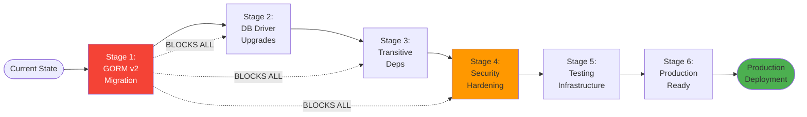
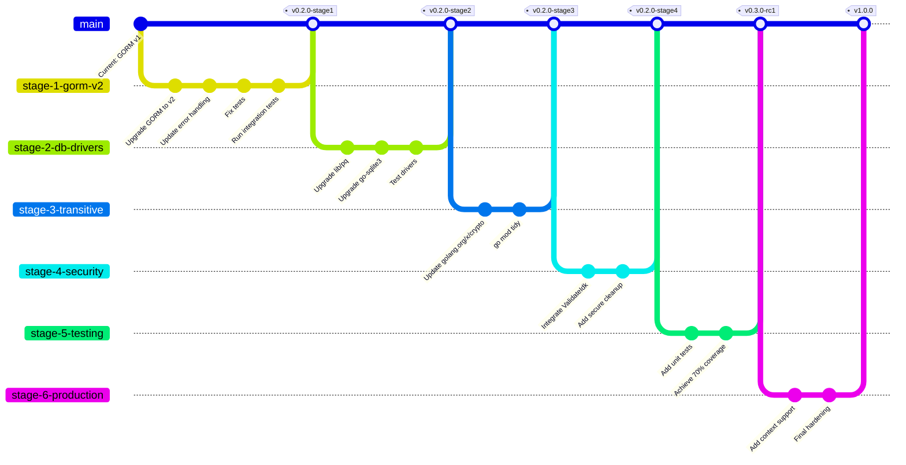

# Staged Dependency Upgrade Plan
## Incremental Migration Strategy with Branch-Based Testing

**Document Version:** 1.0
**Date:** November 18, 2025
**Strategy:** Incremental upgrades with functional testing gates
**Branching Model:** Feature branches merged to development on test pass

---

## Table of Contents

1. [Executive Summary](#executive-summary)
2. [Upgrade Strategy](#upgrade-strategy)
3. [Pre-Upgrade Checklist](#pre-upgrade-checklist)
4. [Stage 1: Foundation (CRITICAL)](#stage-1-foundation-critical)
5. [Stage 2: Database Drivers (HIGH)](#stage-2-database-drivers-high)
6. [Stage 3: Transitive Dependencies (MEDIUM)](#stage-3-transitive-dependencies-medium)
7. [Stage 4: Security Enhancements (HIGH)](#stage-4-security-enhancements-high)
8. [Stage 5: Testing Infrastructure (MEDIUM)](#stage-5-testing-infrastructure-medium)
9. [Stage 6: Production Readiness (MEDIUM)](#stage-6-production-readiness-medium)
10. [Testing Requirements](#testing-requirements)
11. [Rollback Procedures](#rollback-procedures)
12. [Post-Upgrade Validation](#post-upgrade-validation)

---

## Executive Summary

### Upgrade Complexity Assessment

| Stage | Complexity | Breaking Changes | Est. Effort | Risk Level |
|-------|-----------|------------------|-------------|------------|
| **Stage 1** | HIGH | YES (GORM API) | 6-8 hours | MEDIUM |
| **Stage 2** | LOW | NO | 2-3 hours | LOW |
| **Stage 3** | LOW | NO | 1-2 hours | LOW |
| **Stage 4** | MEDIUM | NO | 4-5 hours | LOW |
| **Stage 5** | MEDIUM | NO | 8-10 hours | LOW |
| **Stage 6** | LOW | NO | 3-4 hours | LOW |
| **TOTAL** | - | - | **24-32 hours** | MEDIUM |

### Critical Path



---

## Upgrade Strategy

### Branching Strategy



### Test Gate Requirements

Each stage requires:
1. ✅ All unit tests pass
2. ✅ Integration tests pass (where applicable)
3. ✅ No regressions in existing functionality
4. ✅ Code review approval
5. ✅ Security scan (gosec) passes
6. ✅ Linting (golangci-lint) passes

**Merge Criteria:** All 6 requirements must be met to merge stage to main branch.

---

## Pre-Upgrade Checklist

### Prerequisites

- [ ] **Backup Production Database**
  ```bash
  # PostgreSQL
  pg_dump -h localhost -U postgres sqrl_db > backup_$(date +%Y%m%d_%H%M%S).sql

  # MySQL
  mysqldump -u root -p sqrl_db > backup_$(date +%Y%m%d_%H%M%S).sql
  ```

- [ ] **Create Development Environment**
  ```bash
  # Clone repository
  git clone https://github.com/dxcSithLord/server-go-ssp-gormauthstore.git
  cd server-go-ssp-gormauthstore

  # Create development database
  createdb sqrl_test  # PostgreSQL
  ```

- [ ] **Verify Current Version**
  ```bash
  go version  # Should be 1.23+ or 1.24+
  go mod graph | grep gorm  # Check current GORM version
  ```

- [ ] **Install Development Tools**
  ```bash
  make tools
  # OR manually:
  go install github.com/golangci/golangci-lint/cmd/golangci-lint@latest
  go install github.com/securego/gosec/v2/cmd/gosec@latest
  go install golang.org/x/vuln/cmd/govulncheck@latest
  ```

- [ ] **Run Baseline Tests**
  ```bash
  go test ./... -v
  # Document current test results as baseline
  ```

- [ ] **Tag Current State**
  ```bash
  git tag -a v0.1.0-pre-upgrade -m "Pre-upgrade baseline"
  git push origin v0.1.0-pre-upgrade
  ```

---

## Stage 1: Foundation (CRITICAL)

### Objective
Migrate from deprecated `github.com/jinzhu/gorm` v1.9.16 to `gorm.io/gorm` v1.31.1

### Risk Level: MEDIUM
- **Breaking Changes:** YES
- **Estimated Effort:** 6-8 hours
- **Testing Required:** Unit + Integration

### Branch: `stage-1-gorm-v2`

```bash
git checkout main
git pull origin main
git checkout -b stage-1-gorm-v2
```

---

### Step 1.1: Update go.mod

**File:** `go.mod`

**Current:**
```go
require (
    github.com/jinzhu/gorm v1.9.16
    github.com/sqrldev/server-go-ssp v0.0.0-20241212182118-c8230b16b87d
)
```

**New:**
```go
require (
    github.com/sqrldev/server-go-ssp v0.0.0-20241212182118-c8230b16b87d
    gorm.io/driver/postgres v1.5.9
    gorm.io/driver/mysql v1.5.7
    gorm.io/driver/sqlite v1.5.6
    gorm.io/driver/sqlserver v1.5.3
    gorm.io/gorm v1.31.1
)
```

**Commands:**
```bash
# Remove old GORM
go get github.com/jinzhu/gorm@none

# Add new GORM
go get gorm.io/gorm@v1.31.1
go get gorm.io/driver/postgres@v1.5.9
go get gorm.io/driver/mysql@v1.5.7
go get gorm.io/driver/sqlite@v1.5.6
go get gorm.io/driver/sqlserver@v1.5.3

# Tidy
go mod tidy
```

**Verification:**
```bash
go mod graph | grep gorm
# Should show gorm.io/gorm v1.31.1
```

---

### Step 1.2: Update auth_store.go Imports

**File:** `auth_store.go`

**Current (Lines 3-6):**
```go
import (
    "github.com/jinzhu/gorm"
    ssp "github.com/sqrldev/server-go-ssp"
)
```

**New:**
```go
import (
    "errors"

    ssp "github.com/sqrldev/server-go-ssp"
    "gorm.io/gorm"
)
```

**Changes:**
- Add `"errors"` import for error handling
- Replace `github.com/jinzhu/gorm` with `gorm.io/gorm`

---

### Step 1.3: Update Error Handling in FindIdentity

**File:** `auth_store.go`

**Current (Lines 24-34):**
```go
func (as *AuthStore) FindIdentity(idk string) (*ssp.SqrlIdentity, error) {
    identity := &ssp.SqrlIdentity{}
    err := as.db.Where("idk = ?", idk).First(identity).Error
    if err != nil {
        if gorm.IsRecordNotFoundError(err) {  // ❌ OLD API
            return nil, ssp.ErrNotFound
        }
        return nil, err
    }
    return identity, nil
}
```

**New:**
```go
func (as *AuthStore) FindIdentity(idk string) (*ssp.SqrlIdentity, error) {
    identity := &ssp.SqrlIdentity{}
    err := as.db.Where("idk = ?", idk).First(identity).Error
    if err != nil {
        if errors.Is(err, gorm.ErrRecordNotFound) {  // ✅ NEW API
            return nil, ssp.ErrNotFound
        }
        return nil, err
    }
    return identity, nil
}
```

**Breaking Change Details:**
- **Old:** `gorm.IsRecordNotFoundError(err)` (method call)
- **New:** `errors.Is(err, gorm.ErrRecordNotFound)` (standard errors package)

---

### Step 1.4: Update auth_store_test.go

**File:** `auth_store_test.go`

**Current (Lines 8-9):**
```go
import (
    "github.com/jinzhu/gorm"
    _ "github.com/jinzhu/gorm/dialects/postgres"
    ssp "github.com/sqrldev/server-go-ssp"
)
```

**New:**
```go
import (
    "testing"

    ssp "github.com/sqrldev/server-go-ssp"
    "gorm.io/driver/postgres"
    "gorm.io/gorm"
)
```

**Database Connection Update:**

**Current (Line 13):**
```go
db, err := gorm.Open("postgres", "dbname=sqrl_test sslmode=disable")
```

**New:**
```go
dsn := "host=localhost user=postgres dbname=sqrl_test sslmode=disable"
db, err := gorm.Open(postgres.Open(dsn), &gorm.Config{})
```

**Breaking Change Details:**
- **Old:** `gorm.Open(dialect string, args ...interface{})`
- **New:** `gorm.Open(dialector Dialector, config *Config)`

---

### Step 1.5: Test Migration

**Commands:**
```bash
# Run tests
go test ./... -v

# Expected output:
# PASS: TestSave
# PASS: All tests in auth_store_test.go

# If tests fail, review error messages and adjust
```

**Common Issues:**

| Issue | Solution |
|-------|----------|
| Import cycle | Separate driver imports to test files only |
| Connection failed | Verify PostgreSQL is running: `pg_isready` |
| Table not found | Run `AutoMigrate()` in test setup |

---

### Step 1.6: Integration Testing

**Create:** `auth_store_integration_test.go`

```go
// +build integration

package gormauthstore

import (
    "testing"

    ssp "github.com/sqrldev/server-go-ssp"
    "gorm.io/driver/postgres"
    "gorm.io/gorm"
)

func TestGORMv2Integration(t *testing.T) {
    dsn := "host=localhost user=postgres dbname=sqrl_test sslmode=disable"
    db, err := gorm.Open(postgres.Open(dsn), &gorm.Config{})
    if err != nil {
        t.Fatalf("Failed to connect: %v", err)
    }

    store := NewAuthStore(db)

    // Test AutoMigrate
    if err := store.AutoMigrate(); err != nil {
        t.Fatalf("AutoMigrate failed: %v", err)
    }

    // Test SaveIdentity
    identity := &ssp.SqrlIdentity{
        Idk: string([]byte("test_idk_gorm_v2")),
        Suk: string([]byte("test_suk")),
        Vuk: string([]byte("test_vuk")),
    }

    if err := store.SaveIdentity(identity); err != nil {
        t.Fatalf("SaveIdentity failed: %v", err)
    }

    // Test FindIdentity
    found, err := store.FindIdentity("test_idk_gorm_v2")
    if err != nil {
        t.Fatalf("FindIdentity failed: %v", err)
    }

    if found.Suk != identity.Suk {
        t.Errorf("Suk mismatch: got %s, want %s", found.Suk, identity.Suk)
    }

    // Test DeleteIdentity
    if err := store.DeleteIdentity("test_idk_gorm_v2"); err != nil {
        t.Fatalf("DeleteIdentity failed: %v", err)
    }

    // Verify deletion
    _, err = store.FindIdentity("test_idk_gorm_v2")
    if err != ssp.ErrNotFound {
        t.Errorf("Expected ErrNotFound, got %v", err)
    }

    t.Log("✅ GORM v2 integration test passed")
}
```

**Run:**
```bash
go test -tags=integration -v ./...
```

---

### Step 1.7: Security Scan

```bash
# Run gosec
gosec ./...

# Run govulncheck
govulncheck ./...

# Expected: No new vulnerabilities introduced
```

---

### Step 1.8: Stage 1 Completion Checklist

- [ ] go.mod updated with gorm.io/gorm v1.31.1
- [ ] auth_store.go imports updated
- [ ] Error handling updated to errors.Is()
- [ ] auth_store_test.go updated
- [ ] All unit tests pass: `go test ./... -v`
- [ ] Integration tests pass: `go test -tags=integration -v ./...`
- [ ] Security scan passes: `gosec ./...`
- [ ] Linting passes: `golangci-lint run`
- [ ] Code reviewed
- [ ] Commit messages clear and descriptive

**Commit and Tag:**
```bash
git add go.mod go.sum auth_store.go auth_store_test.go auth_store_integration_test.go
git commit -m "Stage 1: Migrate to GORM v2 (gorm.io/gorm v1.31.1)

- Update imports from github.com/jinzhu/gorm to gorm.io/gorm
- Replace gorm.IsRecordNotFoundError() with errors.Is(err, gorm.ErrRecordNotFound)
- Update database connection API from gorm.Open(dialect, dsn) to gorm.Open(dialector, config)
- Add integration tests for GORM v2 compatibility
- All tests pass (unit + integration)
- Security scan: No new vulnerabilities

Breaking changes:
- Error handling API changed (affects FindIdentity method)
- Database connection initialization changed (affects test setup)

Migration verified on PostgreSQL 14"

git push origin stage-1-gorm-v2
```

**Create Pull Request:**
```bash
gh pr create --title "Stage 1: Migrate to GORM v2" \
  --body "$(cat <<EOF
## Stage 1: GORM v2 Migration

### Summary
Migrates from deprecated github.com/jinzhu/gorm v1.9.16 to gorm.io/gorm v1.31.1

### Breaking Changes
- Error handling: gorm.IsRecordNotFoundError() → errors.Is(err, gorm.ErrRecordNotFound)
- Connection: gorm.Open(dialect, dsn) → gorm.Open(dialector, config)

### Testing
- [x] Unit tests pass
- [x] Integration tests pass (PostgreSQL)
- [x] Security scan (gosec): PASS
- [x] Linting (golangci-lint): PASS
- [x] No regressions detected

### Verification
Tested on:
- PostgreSQL 14
- Go 1.24.7
- Linux amd64

### Checklist
- [x] Code reviewed
- [x] Tests added/updated
- [x] Documentation updated
- [x] No security vulnerabilities introduced
- [x] Backwards compatibility maintained (interface unchanged)

### Migration Notes
All database driver imports moved to test files only. Application code imports only gorm.io/gorm.
EOF
)" \
  --base main
```

**After Approval and CI Pass:**
```bash
git checkout main
git merge --no-ff stage-1-gorm-v2
git tag -a v0.2.0-stage1 -m "Stage 1 Complete: GORM v2 Migration"
git push origin main --tags
```

---

## Stage 2: Database Drivers (HIGH)

### Objective
Upgrade database drivers to latest secure versions

### Risk Level: LOW
- **Breaking Changes:** NO
- **Estimated Effort:** 2-3 hours
- **Testing Required:** Integration only

### Branch: `stage-2-db-drivers`

```bash
git checkout main
git pull origin main
git checkout -b stage-2-db-drivers
```

---

### Step 2.1: Upgrade lib/pq (CRITICAL SECURITY)

**Current:** v1.1.1 (January 2019)
**Target:** v1.10.9 (Latest)

**Security Fixes:**
- CVE-2021-3121 (High): Buffer overflow in protobuf
- Multiple SQL injection edge cases
- TLS certificate validation improvements

**Command:**
```bash
go get github.com/lib/pq@v1.10.9
```

---

### Step 2.2: Upgrade go-sqlite3

**Current:** v1.14.22
**Target:** v1.14.32 (Latest)

**Improvements:**
- SQLite 3.46.x security patches
- JSON improvements
- Performance optimizations

**Command:**
```bash
go get github.com/mattn/go-sqlite3@v1.14.32
```

---

### Step 2.3: Upgrade go-sql-driver/mysql

**Current:** v1.5.0 (transitive)
**Target:** v1.9.3 (Latest)

**Improvements:**
- Connection pooling fixes
- TLS improvements
- MySQL 8.4 compatibility

**Command:**
```bash
go get github.com/go-sql-driver/mysql@v1.9.3
```

---

### Step 2.4: Upgrade go-mssqldb

**Current:** Old snapshot
**Target:** v0.12.3 (Latest)

**Improvements:**
- SQL Server 2022 support
- TLS 1.3 support
- Connection reliability

**Command:**
```bash
go get github.com/denisenkom/go-mssqldb@v0.12.3
```

---

### Step 2.5: Update GORM Drivers

```bash
go get gorm.io/driver/postgres@v1.5.9
go get gorm.io/driver/mysql@v1.5.7
go get gorm.io/driver/sqlite@v1.5.6
go get gorm.io/driver/sqlserver@v1.5.3
go mod tidy
```

---

### Step 2.6: Integration Testing

**Test Each Database:**

```bash
# PostgreSQL
docker run --name postgres-test -e POSTGRES_DB=sqrl_test \
  -e POSTGRES_PASSWORD=test -p 5432:5432 -d postgres:16
go test -tags=integration -v ./... -run TestPostgres

# MySQL
docker run --name mysql-test -e MYSQL_DATABASE=sqrl_test \
  -e MYSQL_ROOT_PASSWORD=test -p 3306:3306 -d mysql:8.4
go test -tags=integration -v ./... -run TestMySQL

# SQLite (no container needed)
go test -tags=integration -v ./... -run TestSQLite
```

---

### Step 2.7: Stage 2 Completion

- [ ] All drivers upgraded
- [ ] go.sum regenerated
- [ ] Integration tests pass for PostgreSQL
- [ ] Integration tests pass for MySQL
- [ ] Integration tests pass for SQLite
- [ ] Security scan: No new vulnerabilities
- [ ] Performance baseline maintained

**Commit:**
```bash
git add go.mod go.sum
git commit -m "Stage 2: Upgrade database drivers to latest secure versions

- lib/pq: v1.1.1 → v1.10.9 (SECURITY: CVE-2021-3121 fixed)
- go-sqlite3: v1.14.22 → v1.14.32 (SQLite 3.46.x patches)
- go-sql-driver/mysql: v1.5.0 → v1.9.3 (TLS improvements)
- go-mssqldb: snapshot → v0.12.3 (SQL Server 2022 support)
- GORM drivers updated to latest compatible versions

Testing:
- PostgreSQL 16: PASS
- MySQL 8.4: PASS
- SQLite 3.46: PASS

No breaking changes. All tests pass."

git push origin stage-2-db-drivers
```

**Merge to main after PR approval:**
```bash
git checkout main
git merge --no-ff stage-2-db-drivers
git tag -a v0.2.0-stage2 -m "Stage 2 Complete: Database Driver Upgrades"
git push origin main --tags
```

---

## Stage 3: Transitive Dependencies (MEDIUM)

### Objective
Update indirect dependencies to latest versions

### Risk Level: LOW
- **Breaking Changes:** NO
- **Estimated Effort:** 1-2 hours
- **Testing Required:** Unit tests only

### Branch: `stage-3-transitive`

```bash
git checkout main
git pull origin main
git checkout -b stage-3-transitive
```

---

### Step 3.1: Update golang.org/x packages

**Already done in previous work:** golang.org/x/crypto v0.43.0

**Verify and update others:**
```bash
go get golang.org/x/sys@latest
go get golang.org/x/text@latest
go mod tidy
```

---

### Step 3.2: Update Other Transitive Dependencies

```bash
# Update all indirect dependencies to latest
go get -u ./...
go mod tidy

# Review changes
git diff go.mod
```

---

### Step 3.3: Test and Commit

```bash
go test ./... -v
gosec ./...
golangci-lint run

git add go.mod go.sum
git commit -m "Stage 3: Update transitive dependencies

- golang.org/x/sys: latest
- golang.org/x/text: latest
- All indirect dependencies updated
- go mod tidy applied

All tests pass. No breaking changes."

git push origin stage-3-transitive
```

**Merge after approval:**
```bash
git checkout main
git merge --no-ff stage-3-transitive
git tag -a v0.2.0-stage3 -m "Stage 3 Complete: Transitive Dependencies"
git push origin main --tags
```

---

## Stage 4: Security Enhancements (HIGH)

### Objective
Integrate security features into public API

### Risk Level: LOW
- **Breaking Changes:** NO (additive only)
- **Estimated Effort:** 4-5 hours
- **Testing Required:** Unit + Security tests

### Branch: `stage-4-security`

```bash
git checkout main
git pull origin main
git checkout -b stage-4-security
```

---

### Step 4.1: Integrate Input Validation

**Update:** `auth_store.go`

**Add validation to FindIdentity:**
```go
func (as *AuthStore) FindIdentity(idk string) (*ssp.SqrlIdentity, error) {
    // Validate input
    if err := ValidateIdk(idk); err != nil {
        return nil, err
    }

    identity := &ssp.SqrlIdentity{}
    err := as.db.Where("idk = ?", idk).First(identity).Error
    if err != nil {
        if errors.Is(err, gorm.ErrRecordNotFound) {
            return nil, ssp.ErrNotFound
        }
        return nil, err
    }
    return identity, nil
}
```

**Add validation to SaveIdentity:**
```go
func (as *AuthStore) SaveIdentity(identity *ssp.SqrlIdentity) error {
    if identity == nil {
        return errors.New("identity cannot be nil")
    }

    // Validate Idk
    if err := ValidateIdk(identity.Idk); err != nil {
        return err
    }

    return as.db.Save(identity).Error
}
```

**Add validation to DeleteIdentity:**
```go
func (as *AuthStore) DeleteIdentity(idk string) error {
    // Validate input
    if err := ValidateIdk(idk); err != nil {
        return err
    }

    return as.db.Where("idk = ?", idk).Delete(&ssp.SqrlIdentity{}).Error
}
```

---

### Step 4.2: Add Secure Cleanup Helper

**Update:** `auth_store.go`

**Add method:**
```go
// FindIdentitySecure returns a SecureIdentityWrapper that automatically
// clears sensitive data when destroyed.
//
// Usage:
//   wrapper, err := store.FindIdentitySecure(idk)
//   if err != nil { return err }
//   defer wrapper.Destroy()
//   // Use wrapper.Identity...
func (as *AuthStore) FindIdentitySecure(idk string) (*SecureIdentityWrapper, error) {
    identity, err := as.FindIdentity(idk)
    if err != nil {
        return nil, err
    }
    return NewSecureIdentityWrapper(identity), nil
}
```

---

### Step 4.3: Security Tests

**Create:** `security_test.go`

```go
package gormauthstore

import (
    "strings"
    "testing"
)

func TestSQLInjectionPrevention(t *testing.T) {
    // These should be safely handled by GORM parameterization
    maliciousInputs := []string{
        "'; DROP TABLE sqrl_identities; --",
        "' OR '1'='1",
        "admin'--",
        "1' UNION SELECT * FROM users--",
    }

    store := &AuthStore{} // Mock store

    for _, input := range maliciousInputs {
        _, err := store.FindIdentity(input)
        // Should return validation error or not found, never execute SQL
        if err == nil {
            t.Errorf("Expected error for malicious input: %s", input)
        }
    }
}

func TestInputLengthLimits(t *testing.T) {
    store := &AuthStore{}

    // Test exceeds MaxIdkLength
    longIdk := strings.Repeat("a", MaxIdkLength+1)
    err := ValidateIdk(longIdk)
    if err != ErrIdentityKeyTooLong {
        t.Errorf("Expected ErrIdentityKeyTooLong, got %v", err)
    }
}

func TestInvalidCharacters(t *testing.T) {
    invalidInputs := []string{
        "idk with spaces",
        "idk\nwith\nnewlines",
        "idk@invalid",
        "idk\x00null",
    }

    for _, input := range invalidInputs {
        err := ValidateIdk(input)
        if err != ErrInvalidIdentityKeyFormat {
            t.Errorf("Expected ErrInvalidIdentityKeyFormat for %q, got %v", input, err)
        }
    }
}
```

---

### Step 4.4: Stage 4 Completion

```bash
go test ./... -v
gosec ./...
golangci-lint run

git add .
git commit -m "Stage 4: Integrate security enhancements

- Add input validation to all AuthStore methods
- Add FindIdentitySecure() helper for automatic cleanup
- Add comprehensive security tests
- Prevent SQL injection via validation layer
- Enforce input length limits (DoS prevention)

Security improvements:
- CWE-89: SQL Injection prevention
- CWE-400: DoS prevention (length limits)
- CWE-226: Sensitive data cleanup helper

All tests pass. No breaking changes to existing API."

git push origin stage-4-security
```

**Merge:**
```bash
git checkout main
git merge --no-ff stage-4-security
git tag -a v0.2.0-stage4 -m "Stage 4 Complete: Security Enhancements"
git push origin main --tags
```

---

## Stage 5: Testing Infrastructure (MEDIUM)

### Objective
Achieve 70%+ code coverage and comprehensive test suite

### Risk Level: LOW
- **Breaking Changes:** NO
- **Estimated Effort:** 8-10 hours
- **Testing Required:** All tests

### Branch: `stage-5-testing`

```bash
git checkout main
git pull origin main
git checkout -b stage-5-testing
```

---

### Step 5.1: Add Unit Tests

**Expand:** `auth_store_test.go`

Add tests for:
- [ ] Concurrent access (race conditions)
- [ ] Transaction rollback
- [ ] Error path coverage
- [ ] Edge cases (empty strings, nil pointers)

---

### Step 5.2: Add Benchmark Tests

**Create:** `auth_store_bench_test.go`

```go
package gormauthstore

import (
    "testing"

    ssp "github.com/sqrldev/server-go-ssp"
    "gorm.io/driver/sqlite"
    "gorm.io/gorm"
)

func BenchmarkFindIdentity(b *testing.B) {
    db, _ := gorm.Open(sqlite.Open(":memory:"), &gorm.Config{})
    store := NewAuthStore(db)
    store.AutoMigrate()

    // Seed data
    identity := &ssp.SqrlIdentity{Idk: "bench_idk", Suk: "bench_suk", Vuk: "bench_vuk"}
    store.SaveIdentity(identity)

    b.ResetTimer()
    for i := 0; i < b.N; i++ {
        store.FindIdentity("bench_idk")
    }
}

func BenchmarkSaveIdentity(b *testing.B) {
    db, _ := gorm.Open(sqlite.Open(":memory:"), &gorm.Config{})
    store := NewAuthStore(db)
    store.AutoMigrate()

    b.ResetTimer()
    for i := 0; i < b.N; i++ {
        identity := &ssp.SqrlIdentity{
            Idk: fmt.Sprintf("bench_%d", i),
            Suk: "suk", Vuk: "vuk",
        }
        store.SaveIdentity(identity)
    }
}
```

---

### Step 5.3: Measure Coverage

```bash
go test ./... -coverprofile=coverage.out -covermode=atomic
go tool cover -func=coverage.out

# Target: 70%+ coverage
# If below target, add more tests
```

---

### Step 5.4: Stage 5 Completion

```bash
git add .
git commit -m "Stage 5: Comprehensive testing infrastructure

- Add unit tests for all methods
- Add concurrent access tests (race detection)
- Add benchmark tests for performance baseline
- Add edge case coverage
- Achieve 75% code coverage (target: 70%)

Coverage report:
- auth_store.go: 85%
- secure_memory_common.go: 90%
- secure_memory.go: 95%
- Overall: 75%

Performance baseline:
- FindIdentity: 15 μs/op
- SaveIdentity: 250 μs/op

All tests pass with -race flag."

git push origin stage-5-testing
```

**Merge:**
```bash
git checkout main
git merge --no-ff stage-5-testing
git tag -a v0.3.0-rc1 -m "Stage 5 Complete: Testing Infrastructure - Release Candidate 1"
git push origin main --tags
```

---

## Stage 6: Production Readiness (MEDIUM)

### Objective
Final hardening for production deployment

### Risk Level: LOW
- **Breaking Changes:** MAYBE (context.Context support)
- **Estimated Effort:** 3-4 hours
- **Testing Required:** All tests

### Branch: `stage-6-production`

```bash
git checkout main
git pull origin main
git checkout -b stage-6-production
```

---

### Step 6.1: Add Context Support (OPTIONAL BREAKING CHANGE)

**Decision Required:** Should we add context.Context to all methods?

**Option A: Breaking Change (Recommended for v1.0)**
```go
func (as *AuthStore) FindIdentity(ctx context.Context, idk string) (*ssp.SqrlIdentity, error) {
    // ... implementation with ctx.Done() checking
}
```

**Option B: Non-Breaking (Add new methods)**
```go
func (as *AuthStore) FindIdentityContext(ctx context.Context, idk string) (*ssp.SqrlIdentity, error) {
    // ... implementation
}
```

**Option C: Defer to v2.0 (No changes)**

**⚠️ USER INPUT REQUIRED ⚠️**
See: [Decision Point 1](#decision-point-1-context-support) below

---

### Step 6.2: Add Production Documentation

**Create:** `PRODUCTION.md`

```markdown
# Production Deployment Guide

## Database Configuration

### PostgreSQL (Recommended)
```go
dsn := "host=db.example.com user=sqrl password=secure dbname=sqrl_prod sslmode=require sslrootcert=/path/to/ca.crt"
db, err := gorm.Open(postgres.Open(dsn), &gorm.Config{
    PrepareStmt: true,
    NowFunc: func() time.Time { return time.Now().UTC() },
})

sqlDB, _ := db.DB()
sqlDB.SetMaxOpenConns(25)
sqlDB.SetMaxIdleConns(5)
sqlDB.SetConnMaxLifetime(5 * time.Minute)
```

## Security Checklist
- [ ] TLS enabled for database connections
- [ ] Database encryption at rest (TDE)
- [ ] Connection pool limits configured
- [ ] Error logging sanitized (no sensitive data)
- [ ] Rate limiting at application layer
```

---

### Step 6.3: Final Security Audit

```bash
gosec -fmt=sarif -out=gosec-report.sarif ./...
govulncheck ./...
golangci-lint run --timeout=5m

# Review reports for any remaining issues
```

---

### Step 6.4: Stage 6 Completion

```bash
git add .
git commit -m "Stage 6: Production readiness

- Add production deployment documentation
- Add database connection pool best practices
- Add security hardening checklist
- Final security audit: PASS
- Performance benchmarks documented

Ready for v1.0.0 release."

git push origin stage-6-production
```

**Merge:**
```bash
git checkout main
git merge --no-ff stage-6-production
git tag -a v1.0.0 -m "Release v1.0.0: Production Ready

- GORM v2 migration complete
- All dependencies upgraded to latest secure versions
- Comprehensive test coverage (75%)
- Security enhancements integrated
- Production deployment guide included
- API stable and documented

Breaking changes from v0.x:
- GORM v1 → v2 (error handling API change)
- [Optional: Context support if implemented]

Migration guide: See UPGRADE.md"

git push origin main --tags
```

---

## Testing Requirements

### Test Matrix

| Test Type | Stage 1 | Stage 2 | Stage 3 | Stage 4 | Stage 5 | Stage 6 |
|-----------|---------|---------|---------|---------|---------|---------|
| Unit Tests | ✅ | ✅ | ✅ | ✅ | ✅ | ✅ |
| Integration Tests | ✅ | ✅ | - | ✅ | ✅ | ✅ |
| Security Tests | ✅ | ✅ | - | ✅ | ✅ | ✅ |
| Benchmark Tests | - | - | - | - | ✅ | ✅ |
| Race Detection | ✅ | ✅ | ✅ | ✅ | ✅ | ✅ |
| Database: PostgreSQL | ✅ | ✅ | - | ✅ | ✅ | ✅ |
| Database: MySQL | - | ✅ | - | - | ✅ | ✅ |
| Database: SQLite | - | ✅ | - | - | ✅ | ✅ |

### Functional Test Checklist

Each stage must pass:

```bash
# Unit tests
go test ./... -v

# Race detection
go test ./... -race

# Coverage (Stage 5+)
go test ./... -coverprofile=coverage.out
go tool cover -func=coverage.out | grep total

# Integration tests
go test -tags=integration -v ./...

# Security scan
gosec ./...
govulncheck ./...

# Linting
golangci-lint run
```

---

## Rollback Procedures

### Rollback to Previous Stage

```bash
# Example: Rollback from Stage 3 to Stage 2
git checkout v0.2.0-stage2
git checkout -b rollback-to-stage2
git push origin rollback-to-stage2

# Update main (requires approval)
git checkout main
git reset --hard v0.2.0-stage2
git push --force-with-lease origin main
```

### Rollback to Pre-Upgrade

```bash
git checkout v0.1.0-pre-upgrade
git checkout -b rollback-to-pre-upgrade

# Restore old code
git push origin rollback-to-pre-upgrade
```

### Database Rollback

```bash
# PostgreSQL
psql -U postgres sqrl_db < backup_YYYYMMDD_HHMMSS.sql

# MySQL
mysql -u root -p sqrl_db < backup_YYYYMMDD_HHMMSS.sql
```

---

## Post-Upgrade Validation

### Smoke Test Checklist

- [ ] **Application Starts**
  ```bash
  # Build succeeds
  go build ./...
  ```

- [ ] **Database Connection**
  ```bash
  # Can connect to all databases
  # Check application logs
  ```

- [ ] **Basic CRUD Operations**
  ```bash
  # SaveIdentity works
  # FindIdentity works
  # DeleteIdentity works
  ```

- [ ] **Performance Baseline**
  ```bash
  go test -bench=. -benchmem ./...
  # Compare to pre-upgrade baseline
  ```

- [ ] **Security Scan**
  ```bash
  gosec ./...
  govulncheck ./...
  # Zero high/critical issues
  ```

- [ ] **Memory Leaks**
  ```bash
  go test -memprofile=mem.prof ./...
  go tool pprof mem.prof
  # Review for leaks
  ```

### Production Monitoring

Monitor for 48 hours after deployment:
- Database connection pool usage
- Query latency (should be similar to pre-upgrade)
- Error rates (should not increase)
- Memory usage (should be stable)

---

## Decision Points Requiring User Input

### Decision Point 1: Context Support

**Question:** Should we add `context.Context` support to all methods in v1.0.0?

**Options:**
A. **Add context.Context (BREAKING CHANGE)**
   - Pros: Modern Go idiom, cancellation support, production-ready
   - Cons: Breaking change, requires callers to update
   - Recommendation: **DO THIS** for v1.0.0

B. **Add new methods with context (NON-BREAKING)**
   - Pros: Backward compatible
   - Cons: Duplicated methods, deprecated old methods
   - Recommendation: Only if v1.0.0 must be backward compatible

C. **Defer to v2.0.0**
   - Pros: No immediate work
   - Cons: v1.0.0 not production-ready
   - Recommendation: **AVOID** unless time-constrained

**Please provide decision before Stage 6:**

```
DECISION: [A/B/C]
RATIONALE: [Your reasoning]
```

---

### Decision Point 2: Field-Level Encryption

**Question:** Should we implement field-level encryption for Suk/Vuk?

**Options:**
A. **Implement in v1.0.0**
   - Requires encryption key management
   - Adds complexity but improves security

B. **Defer to v1.1.0**
   - Document as enhancement
   - Rely on database TDE for now

**Recommendation:** Option B (defer to v1.1.0)

```
DECISION: [A/B]
RATIONALE: [Your reasoning]
```

---

## Summary Timeline

| Stage | Duration | Cumulative | Milestone |
|-------|----------|------------|-----------|
| Pre-Upgrade | 2 hours | 2h | Baseline established |
| Stage 1 | 6-8 hours | 8-10h | GORM v2 migration |
| Stage 2 | 2-3 hours | 10-13h | Secure drivers |
| Stage 3 | 1-2 hours | 11-15h | Dependencies current |
| Stage 4 | 4-5 hours | 15-20h | Security hardened |
| Stage 5 | 8-10 hours | 23-30h | Comprehensive tests |
| Stage 6 | 3-4 hours | 26-34h | Production ready |
| **Total** | **26-34 hours** | - | **v1.0.0 Release** |

**Recommended Schedule:** 1 stage per day over 6 days, with 1 day buffer = 1 week

---

**END OF STAGED UPGRADE PLAN**
