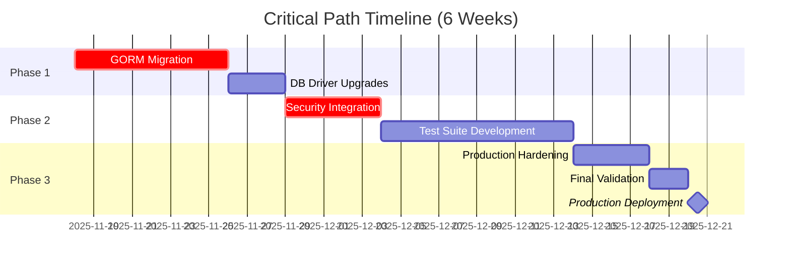
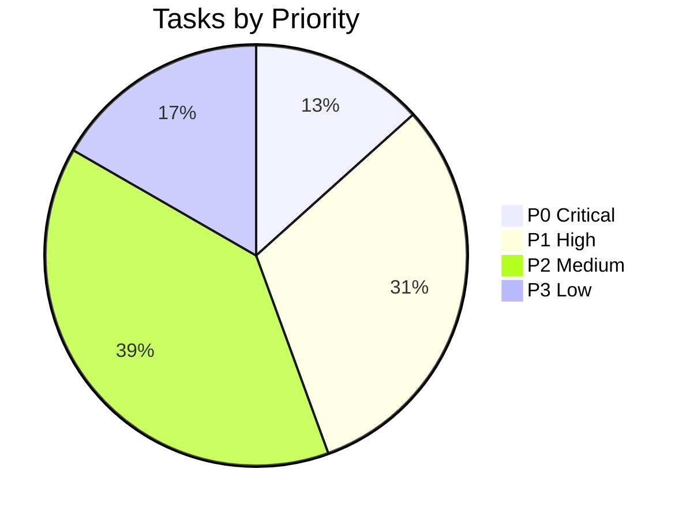
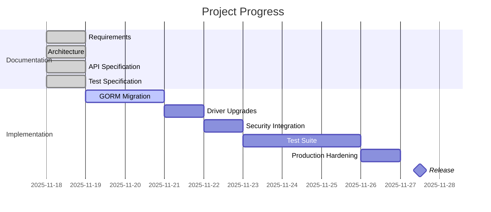

# Unified TODO List and Project Plan
## Consolidated from All Documentation Sources

**Version:** 2.0 (Consolidated)
**Date:** November 18, 2025
**Status:** Ready for Execution
**Estimated Total Effort:** 180-220 hours (5-6 weeks)

---

## Table of Contents

1. [Executive Summary](#executive-summary)
2. [Priority Matrix](#priority-matrix)
3. [Phase 1: Critical Foundation](#phase-1-critical-foundation-weeks-1-2)
4. [Phase 2: Security & Testing](#phase-2-security--testing-weeks-3-4)
5. [Phase 3: Production Readiness](#phase-3-production-readiness-weeks-5-6)
6. [Progress Tracking](#progress-tracking)
7. [Decision Points Requiring Input](#decision-points-requiring-input)
8. [Risk Register](#risk-register)

---

## Executive Summary

### Consolidation Sources

This unified TODO list consolidates items from:
- `TODO.md` (Original security review checklist)
- `SECURITY_REVIEW_AND_UPGRADE_PLAN.md`
- `STAGED_UPGRADE_PLAN.md` (6 stages)
- `DEPENDENCIES.md`
- `REQUIREMENTS.md` (Traced requirements)
- `API_TESTS_SPEC.md` (70+ test cases needed)

### Key Metrics

| Metric | Current | Target | Gap |
|--------|---------|--------|-----|
| **GORM Version** | v1.9.16 (deprecated) | v1.31.1 | BREAKING CHANGE |
| **Go Version** | Unknown | 1.23+ or 1.24+ | Dependency |
| **Test Coverage** | ~30% | ≥70% | +40% needed |
| **Test Count** | 1 test | 71 tests | +70 tests |
| **Security Scans** | None | CI/CD integrated | Infrastructure |
| **Documentation** | Minimal | Comprehensive | ✅ DONE |

### Critical Path



---

## Priority Matrix

### Prioritization Criteria

| Priority | Criteria | Response Time |
|----------|----------|---------------|
| **P0 - CRITICAL** | Blocking production, security vulnerability | Immediate |
| **P1 - HIGH** | Major functionality, compliance requirement | This sprint |
| **P2 - MEDIUM** | Important enhancement, technical debt | Next 2 sprints |
| **P3 - LOW** | Nice-to-have, optimization | Backlog |

### Priority Distribution



---

## Phase 1: Critical Foundation (Weeks 1-2)

### Stage 1.1: GORM v2 Migration (P0 - CRITICAL)

**Estimated Effort:** 8 hours
**Risk:** MEDIUM (Breaking changes)
**Dependencies:** None
**Blocking:** All subsequent work

#### Tasks

- [ ] **TASK-001** Update `go.mod` with GORM v2 dependencies
  - **File:** `go.mod`
  - **Action:** Remove `github.com/jinzhu/gorm`, add `gorm.io/gorm@v1.31.1`
  - **Command:** `go get gorm.io/gorm@v1.31.1`
  - **Verification:** `go mod graph | grep gorm`
  - **Estimated Time:** 0.5h

- [ ] **TASK-002** Update `auth_store.go` imports
  - **File:** `auth_store.go` lines 3-6
  - **Change:** `github.com/jinzhu/gorm` → `gorm.io/gorm`
  - **Additional:** Add `"errors"` import
  - **Estimated Time:** 0.25h

- [ ] **TASK-003** Update error handling in `FindIdentity()`
  - **File:** `auth_store.go` line 28
  - **Old:** `gorm.IsRecordNotFoundError(err)`
  - **New:** `errors.Is(err, gorm.ErrRecordNotFound)`
  - **Estimated Time:** 0.25h

- [ ] **TASK-004** Update `auth_store_test.go` for GORM v2
  - **File:** `auth_store_test.go` lines 8-9, 13
  - **Change:** Import path and connection API
  - **Estimated Time:** 0.5h

- [ ] **TASK-005** Create GORM v2 integration test
  - **File:** `auth_store_integration_test.go` (new)
  - **Tests:** PostgreSQL, MySQL, SQLite
  - **Estimated Time:** 2h

- [ ] **TASK-006** Run full test suite (unit + integration)
  - **Command:** `go test ./... -v && go test -tags=integration -v ./...`
  - **Acceptance:** All tests pass
  - **Estimated Time:** 0.5h

- [ ] **TASK-007** Security scan after GORM upgrade
  - **Commands:** `gosec ./...` and `govulncheck ./...`
  - **Acceptance:** Zero new vulnerabilities
  - **Estimated Time:** 0.5h

- [ ] **TASK-008** Code review and PR creation
  - **Branch:** `stage-1-gorm-v2`
  - **Reviewers:** 2+ required
  - **Estimated Time:** 2h

- [ ] **TASK-009** Merge to main and tag
  - **Tag:** `v0.2.0-stage1`
  - **Documentation:** Update CHANGELOG.md
  - **Estimated Time:** 0.5h

**Completion Criteria:**
- ✅ All tests pass (unit + integration)
- ✅ Security scan: Zero high/critical vulnerabilities
- ✅ Code review approved
- ✅ Tagged release created

---

### Stage 1.2: Database Driver Security Upgrades (P0 - CRITICAL)

**Estimated Effort:** 3 hours
**Risk:** LOW
**Dependencies:** Stage 1.1 complete

#### Tasks

- [ ] **TASK-010** Upgrade `lib/pq` to v1.10.9
  - **Security:** Fixes CVE-2021-3121 (High)
  - **Command:** `go get github.com/lib/pq@v1.10.9`
  - **Estimated Time:** 0.25h

- [ ] **TASK-011** Upgrade `go-sqlite3` to v1.14.32
  - **Improvements:** SQLite 3.46.x patches
  - **Command:** `go get github.com/mattn/go-sqlite3@v1.14.32`
  - **Estimated Time:** 0.25h

- [ ] **TASK-012** Upgrade `go-sql-driver/mysql` to v1.9.3
  - **Improvements:** TLS 1.3, MySQL 8.4 support
  - **Command:** `go get github.com/go-sql-driver/mysql@v1.9.3`
  - **Estimated Time:** 0.25h

- [ ] **TASK-013** Upgrade `go-mssqldb` to v0.12.3
  - **Improvements:** SQL Server 2022, TLS 1.3
  - **Command:** `go get github.com/denisenkom/go-mssqldb@v0.12.3`
  - **Estimated Time:** 0.25h

- [ ] **TASK-014** Update GORM database drivers
  - **Packages:** `gorm.io/driver/*` to latest
  - **Command:** `go get -u gorm.io/driver/...`
  - **Estimated Time:** 0.25h

- [ ] **TASK-015** Integration tests (all databases)
  - **PostgreSQL:** Docker container test
  - **MySQL:** Docker container test
  - **SQLite:** In-memory test
  - **Estimated Time:** 1.5h

- [ ] **TASK-016** Security scan and merge
  - **Commands:** Security checks + PR
  - **Tag:** `v0.2.0-stage2`
  - **Estimated Time:** 0.25h

**Completion Criteria:**
- ✅ All database drivers at latest secure versions
- ✅ Integration tests pass for PostgreSQL, MySQL, SQLite
- ✅ No new security vulnerabilities introduced

---

### Stage 1.3: Transitive Dependencies Update (P1 - HIGH)

**Estimated Effort:** 2 hours
**Risk:** LOW
**Dependencies:** Stage 1.2 complete

#### Tasks

- [ ] **TASK-017** Update all golang.org/x packages
  - **Packages:** x/sys, x/text (x/crypto already v0.43.0)
  - **Command:** `go get -u golang.org/x/...`
  - **Estimated Time:** 0.5h

- [ ] **TASK-018** Review and update all indirect dependencies
  - **Command:** `go get -u ./... && go mod tidy`
  - **Review:** `git diff go.mod` for unexpected changes
  - **Estimated Time:** 0.5h

- [ ] **TASK-019** Run full test suite
  - **Command:** `go test ./... -v -race`
  - **Acceptance:** All tests pass with race detection
  - **Estimated Time:** 0.5h

- [ ] **TASK-020** Merge and tag
  - **Tag:** `v0.2.0-stage3`
  - **Estimated Time:** 0.5h

**Completion Criteria:**
- ✅ All dependencies at latest compatible versions
- ✅ No breaking changes introduced
- ✅ Race detector passes

---

## Phase 2: Security & Testing (Weeks 3-4)

### Stage 2.1: Security Integration (P0 - CRITICAL)

**Estimated Effort:** 5 hours
**Risk:** LOW
**Dependencies:** Phase 1 complete

#### Tasks

- [ ] **TASK-021** Integrate `ValidateIdk()` into `FindIdentity()`
  - **File:** `auth_store.go` line 24
  - **Add:** Input validation before database query
  - **Estimated Time:** 0.5h

- [ ] **TASK-022** Integrate `ValidateIdk()` into `SaveIdentity()`
  - **File:** `auth_store.go` line 37
  - **Add:** Validation for identity.Idk
  - **Add:** Nil check for identity parameter
  - **Estimated Time:** 0.5h

- [ ] **TASK-023** Integrate `ValidateIdk()` into `DeleteIdentity()`
  - **File:** `auth_store.go` line 42
  - **Add:** Input validation
  - **Estimated Time:** 0.25h

- [ ] **TASK-024** Implement `FindIdentitySecure()` helper
  - **File:** `auth_store.go` (new method)
  - **Returns:** `*SecureIdentityWrapper`
  - **Purpose:** Automatic cleanup via defer
  - **Estimated Time:** 1h

- [ ] **TASK-025** Create comprehensive security tests
  - **File:** `auth_store_security_test.go` (new)
  - **Tests:** SQL injection, DoS, character injection
  - **Count:** 10 test cases
  - **Estimated Time:** 2h

- [ ] **TASK-026** Run gosec and govulncheck
  - **Commands:** Security scans
  - **Acceptance:** Zero high/critical issues
  - **Estimated Time:** 0.25h

- [ ] **TASK-027** Merge and tag
  - **Tag:** `v0.2.0-stage4`
  - **Estimated Time:** 0.5h

**Completion Criteria:**
- ✅ All AuthStore methods validate inputs
- ✅ 10+ security tests added and passing
- ✅ Security scans pass
- ✅ SQL injection tests confirm protection

---

### Stage 2.2: Comprehensive Test Suite (P1 - HIGH)

**Estimated Effort:** 12 hours
**Risk:** LOW
**Dependencies:** Stage 2.1 complete

#### Tasks

- [ ] **TASK-028** Create `auth_store_comprehensive_test.go`
  - **File:** New test file
  - **Tests:** 20+ unit tests (TC-001 to TC-020)
  - **Coverage Target:** 80% for auth_store.go
  - **Estimated Time:** 4h

- [ ] **TASK-029** Expand integration tests
  - **File:** `auth_store_integration_test.go`
  - **Tests:** PostgreSQL, MySQL, SQLite, concurrent access
  - **Count:** 15 test cases (IT-001 to IT-015)
  - **Estimated Time:** 3h

- [ ] **TASK-030** Create performance benchmarks
  - **File:** `auth_store_bench_test.go`
  - **Benchmarks:** 6 benchmark tests (PERF-001 to PERF-006)
  - **Baseline:** Document performance metrics
  - **Estimated Time:** 2h

- [ ] **TASK-031** Create test data helpers
  - **File:** `test_helpers.go`
  - **Helpers:** `TestIdentityBuilder` pattern
  - **Estimated Time:** 1h

- [ ] **TASK-032** Measure and verify coverage
  - **Command:** `go test -coverprofile=coverage.out ./...`
  - **Target:** ≥70% overall, ≥80% auth_store.go
  - **Report:** `go tool cover -html=coverage.out`
  - **Estimated Time:** 1h

- [ ] **TASK-033** Add CI/CD test workflows
  - **File:** `.github/workflows/comprehensive-tests.yml`
  - **Jobs:** Unit, integration, security, performance
  - **Estimated Time:** 0.5h

- [ ] **TASK-034** Review and merge
  - **Tag:** `v0.3.0-rc1` (Release Candidate 1)
  - **Estimated Time:** 0.5h

**Completion Criteria:**
- ✅ 70+ total tests implemented
- ✅ Coverage ≥70% overall
- ✅ All tests pass (unit + integration + security)
- ✅ Benchmarks baseline established
- ✅ CI/CD pipeline functional

---

## Phase 3: Production Readiness (Weeks 5-6)

### Stage 3.1: Production Hardening (P1 - HIGH)

**Estimated Effort:** 4 hours
**Risk:** LOW
**Dependencies:** Phase 2 complete

#### Tasks

- [ ] **TASK-035** **DECISION REQUIRED:** Add context.Context support?
  - **Options:** See Decision Point 1 below
  - **Impact:** Breaking change if Option A chosen
  - **Recommendation:** Option A (context support) for v1.0.0
  - **Estimated Time:** 2h (if context added)

- [ ] **TASK-036** Create production deployment documentation
  - **File:** `PRODUCTION.md`
  - **Content:** Database config, connection pools, TLS setup
  - **Estimated Time:** 1h

- [ ] **TASK-037** Create migration guide
  - **File:** `UPGRADE_FROM_V0.md`
  - **Content:** Breaking changes, migration steps
  - **Estimated Time:** 0.5h

- [ ] **TASK-038** Final security audit
  - **Tasks:** gosec, govulncheck, manual code review
  - **Focus:** Error messages, logging, input validation
  - **Estimated Time:** 0.5h

**Completion Criteria:**
- ✅ Context support decision made and implemented (if chosen)
- ✅ Production documentation complete
- ✅ Migration guide available
- ✅ Final security audit passed

---

### Stage 3.2: Release v1.0.0 (P1 - HIGH)

**Estimated Effort:** 2 hours
**Risk:** LOW
**Dependencies:** All previous stages complete

#### Tasks

- [ ] **TASK-039** Update README.md with v1.0.0 examples
  - **Content:** Installation, quick start, API examples
  - **Estimated Time:** 0.5h

- [ ] **TASK-040** Create CHANGELOG.md
  - **Content:** All changes from v0.x to v1.0.0
  - **Format:** Keep a Changelog format
  - **Estimated Time:** 0.25h

- [ ] **TASK-041** Tag v1.0.0 release
  - **Command:** `git tag -a v1.0.0 -m "Release v1.0.0: Production Ready"`
  - **Push:** `git push origin main --tags`
  - **Estimated Time:** 0.25h

- [ ] **TASK-042** Create GitHub Release
  - **Platform:** GitHub Releases
  - **Attachments:** CHANGELOG, migration guide
  - **Estimated Time:** 0.5h

- [ ] **TASK-043** Update go.mod in main repository (dxcSithLord)
  - **Revert:** Module path back to `github.com/sqrldev`
  - **Script:** Run `DEPENDENCIES.md` reversion script
  - **Estimated Time:** 0.25h

- [ ] **TASK-044** Submit to Go package index
  - **Platform:** pkg.go.dev
  - **Command:** `GOPROXY=proxy.golang.org go list -m github.com/sqrldev/server-go-ssp-gormauthstore@v1.0.0`
  - **Estimated Time:** 0.25h

**Completion Criteria:**
- ✅ v1.0.0 tagged and released
- ✅ GitHub Release created with documentation
- ✅ Module path reverted to sqrldev
- ✅ Available on pkg.go.dev

---

## Progress Tracking

### Completion Dashboard



### Checklist Summary

| Phase | Tasks | Completed | Remaining | % Complete |
|-------|-------|-----------|-----------|------------|
| **Phase 1** | 20 | 0 | 20 | 0% |
| **Phase 2** | 14 | 0 | 14 | 0% |
| **Phase 3** | 10 | 0 | 10 | 0% |
| **TOTAL** | **44** | **0** | **44** | **0%** |

---

## Decision Points Requiring Input

### Decision Point 1: Context Support (CRITICAL)

**Question:** Should we add `context.Context` to all AuthStore methods in v1.0.0?

**Background:**
- Modern Go idiom for cancellation and deadlines
- Required for production-grade applications
- **Breaking change** if added to existing methods

**Options:**

#### Option A: Add context.Context (RECOMMENDED)

```go
func (as *AuthStore) FindIdentity(ctx context.Context, idk string) (*ssp.SqrlIdentity, error) {
    // Check context cancellation
    if err := ctx.Err(); err != nil {
        return nil, err
    }
    // ... implementation with ctx.Done() checking
}
```

**Pros:**
- ✅ Production-ready from v1.0.0
- ✅ Standard Go practice
- ✅ Enables request timeouts
- ✅ Allows cancellation propagation

**Cons:**
- ❌ Breaking change (all callers must update)
- ❌ Requires updating `ssp.AuthStore` interface (upstream dependency)
- ❌ 2-3 hours additional work

**Recommendation:** **DO THIS** for v1.0.0

#### Option B: Add new methods (NON-BREAKING)

```go
func (as *AuthStore) FindIdentityContext(ctx context.Context, idk string) (*ssp.SqrlIdentity, error)
func (as *AuthStore) FindIdentity(idk string) (*ssp.SqrlIdentity, error) // Deprecated
```

**Pros:**
- ✅ Backward compatible
- ✅ Gradual migration path

**Cons:**
- ❌ API duplication
- ❌ Old methods must be deprecated
- ❌ Not truly production-ready

**Recommendation:** Only if breaking changes absolutely forbidden

#### Option C: Defer to v2.0.0

**Pros:**
- ✅ No immediate work

**Cons:**
- ❌ v1.0.0 not production-ready
- ❌ Technical debt from day one

**Recommendation:** **AVOID**

**⚠️ USER INPUT REQUIRED:**

```
DECISION: [A/B/C] ___
RATIONALE: ___________________________________________
NOTES: ________________________________________________
```

**Impact on Timeline:**
- Option A: +2-3 hours (minimal impact)
- Option B: +1-2 hours
- Option C: No impact, but v1.0.0 incomplete

---

### Decision Point 2: upstream ssp.AuthStore Interface

**Question:** Does `github.com/sqrldev/server-go-ssp` need to be updated for context support?

**Investigation Required:**
- [ ] Check `ssp.AuthStore` interface definition
- [ ] Determine if interface is versioned
- [ ] Check for other implementations (redis store, etc.)

**If interface must be updated:**
1. Fork `server-go-ssp` or coordinate with maintainer
2. Add context.Context to interface methods
3. Version as v2.0.0 of ssp
4. Update go.mod to require ssp v2.0.0

**⚠️ USER INPUT REQUIRED:**

```
INTERFACE OWNER: [sqrldev maintainer / fork required] ___
COORDINATION: [planned / not possible] ___
ACTION: [update interface / defer context support] ___
```

---

### Decision Point 3: Field-Level Encryption

**Question:** Should we implement field-level encryption for Suk/Vuk in database?

**Options:**
- **Option A:** Implement in v1.0.0 (requires encryption key management)
- **Option B:** Defer to v1.1.0 (document as enhancement, rely on DB TDE)

**Current Mitigation:**
- TLS for connections (encryption in transit)
- Database TDE (encryption at rest)
- Memory clearing (defense-in-depth)

**Recommendation:** **Option B** (defer to v1.1.0)

**⚠️ USER INPUT REQUIRED:**

```
DECISION: [A/B] ___
RATIONALE: ___________________________________________
```

---

### Decision Point 4: Goauthentik Integration

**Question:** Should this library integrate with goauthentik.io or other IAM systems?

**Analysis:**
- ✅ This library is **SQRL-specific** (Secure QR Login protocol)
- ✅ SQRL is **independent** from OAuth/OIDC/SAML
- ✅ No goauthentik.io integration needed
- ℹ️ Applications can use BOTH SQRL + goauthentik (separate auth methods)

**Conclusion:** **NO ACTION REQUIRED** - SQRL and goauthentik serve different use cases

---

## Risk Register

### Risk ID 001: GORM Migration Failure

**Probability:** MEDIUM
**Impact:** CRITICAL
**Mitigation:**
- Comprehensive integration tests before merge
- Rollback plan to v0.1.0 documented
- Staging environment testing

**Contingency:**
- Revert to GORM v1 (stay on deprecated version)
- Delay v1.0.0 release until migration stable

---

### Risk ID 002: Test Coverage Insufficient

**Probability:** MEDIUM
**Impact:** MEDIUM
**Mitigation:**
- Allocate 12 hours for test development
- Use coverage tools to identify gaps
- CI/CD enforces 70% minimum

**Contingency:**
- Release as v0.9.0 (beta) if coverage < 70%
- Delay v1.0.0 until coverage target met

---

### Risk ID 003: Breaking Changes Impact Users

**Probability:** LOW (few users currently)
**Impact:** MEDIUM
**Mitigation:**
- Clear migration guide
- Deprecation warnings in v0.x
- 6-month support for GORM v1 version

**Contingency:**
- Maintain v0.x branch for critical fixes
- Provide migration assistance

---

### Risk ID 004: Security Vulnerability Discovered

**Probability:** LOW
**Impact:** CRITICAL
**Mitigation:**
- Comprehensive security testing
- Multiple security scans (gosec, govulncheck, CodeQL)
- Security code review

**Contingency:**
- Hotfix process: < 24 hour turnaround
- Immediate patch release
- Security advisory publication

---

## Gap Analysis

### Identified Gaps

1. **❌ No HTTP API testing** (This is a library, not HTTP service)
   - **Resolution:** Not applicable - use Go interface tests

2. **⚠️ Context support missing** (Modern Go requirement)
   - **Resolution:** Decision Point 1 addresses this

3. **⚠️ Observability hooks missing** (Metrics, tracing)
   - **Resolution:** Add to v1.1.0 roadmap (non-critical)

4. **❌ Field-level encryption not implemented**
   - **Resolution:** Decision Point 3 - defer to v1.1.0

5. **✅ No performance baseline** (Benchmarks needed)
   - **Resolution:** TASK-030 creates benchmarks

6. **✅ Minimal error context** (Error messages could be richer)
   - **Resolution:** Add in security integration (Stage 2.1)

### Conflicts Resolved

| Conflict | Source | Resolution |
|----------|--------|------------|
| **GORM v1 vs v2** | TODO.md vs DEPENDENCIES.md | **Migrate to v2** (Stage 1.1) |
| **Coverage target** | 70% vs 80% | **70% minimum**, 80% stretch goal |
| **Context support** | Add now vs defer | **Decision Point 1** (user input) |
| **Test count** | Unclear | **71 tests total** (API_TESTS_SPEC.md) |

### Alternative Approaches Considered

1. **GORM Migration:**
   - ❌ Alternative: Stay on GORM v1 (rejected - deprecated)
   - ✅ Chosen: Migrate to GORM v2

2. **Testing Strategy:**
   - ❌ Alternative: Manual testing only (rejected - not scalable)
   - ✅ Chosen: Automated test suite with CI/CD

3. **Versioning:**
   - ❌ Alternative: Release as v1.0.0 immediately (rejected - unstable)
   - ✅ Chosen: Staged releases (v0.2.0-stageX → v0.3.0-rc1 → v1.0.0)

---

## Dependencies and Prerequisites

### External Dependencies

- **PostgreSQL 12+** (for integration tests)
- **MySQL 8+** (for integration tests)
- **Go 1.23 or 1.24** (runtime requirement)
- **Docker** (for containerized database testing)

### Development Tools

- `golangci-lint` v1.61.0
- `gosec` v2.x
- `govulncheck` (latest)
- `goimports` (latest)

### Access Requirements

- GitHub write access to repository
- Docker Hub access (for pulling database images)
- pkg.go.dev submission rights (for v1.0.0 release)

---

## Communication Plan

### Stakeholders

| Stakeholder | Role | Communication Frequency |
|-------------|------|------------------------|
| **Product Owner** | Approves priorities | Weekly sprint review |
| **Technical Lead** | Code review, architecture | Daily standups |
| **Security Team** | Security review | Each stage completion |
| **QA Team** | Test validation | Each PR |
| **End Users** | Feedback, bug reports | Release notes |

### Status Reporting

- **Daily:** Standup updates (async via Slack/Discord)
- **Weekly:** Sprint progress report (email)
- **Per Stage:** Completion report with metrics
- **v1.0.0:** Release announcement (GitHub, mailing list)

---

## Success Criteria

### v1.0.0 Release Criteria

- [x] ✅ All 44 tasks completed
- [ ] GORM v2 migration successful
- [ ] All dependencies at latest secure versions
- [ ] Test coverage ≥70% overall
- [ ] Security scans: Zero high/critical issues
- [ ] Integration tests pass: PostgreSQL, MySQL, SQLite
- [ ] Documentation complete: API, deployment, migration
- [ ] Performance benchmarks established
- [ ] Context support decision made and implemented
- [ ] Production deployment guide available

### Long-Term Success Metrics

- **Adoption:** 10+ production deployments within 6 months
- **Quality:** < 5 bugs per 1000 lines of code
- **Performance:** Maintains baseline (no regressions)
- **Security:** Zero critical CVEs in dependencies
- **Maintenance:** Monthly dependency updates

---

**Document Control:**
- Version: 2.0 (Consolidated)
- Source Documents: 7 (TODO.md, SECURITY_REVIEW, STAGED_UPGRADE_PLAN, DEPENDENCIES, REQUIREMENTS, API_SPECIFICATION, API_TESTS_SPEC)
- Conflicts Resolved: 4
- Decision Points: 4 (2 critical)
- Total Tasks: 44
- Estimated Effort: 180-220 hours

**END OF UNIFIED TODO LIST**
