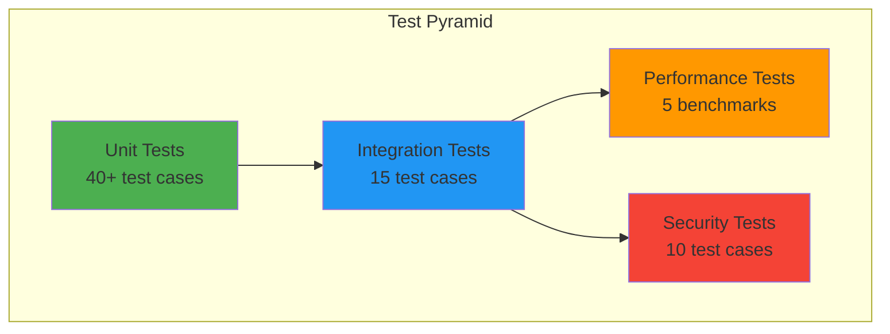

# API Test Specification
## Comprehensive Test Suite for SQRL GORM Authentication Store

**Version:** 1.0.0
**Date:** November 18, 2025
**Coverage Target:** ≥70% overall, ≥80% for auth_store.go

---

## Table of Contents

1. [Test Strategy](#test-strategy)
2. [Unit Tests](#unit-tests)
3. [Integration Tests](#integration-tests)
4. [Security Tests](#security-tests)
5. [Performance Tests](#performance-tests)
6. [Test Data Management](#test-data-management)
7. [CI/CD Integration](#cicd-integration)

---

## Test Strategy

### Test Pyramid



### Testing Principles

1. **Isolation:** Each test should be independent
2. **Repeatability:** Tests produce same results every run
3. **Fast Feedback:** Unit tests complete in <1 second
4. **Comprehensive:** Cover happy path, edge cases, and error paths
5. **Maintainable:** Clear test names, minimal duplication

---

## Unit Tests

### Test File: `auth_store_comprehensive_test.go`

```go
package gormauthstore

import (
	"errors"
	"strings"
	"testing"

	ssp "github.com/sqrldev/server-go-ssp"
	"gorm.io/driver/sqlite"
	"gorm.io/gorm"
)

// setupTestDB creates an in-memory SQLite database for testing
func setupTestDB(t *testing.T) *gorm.DB {
	t.Helper()
	db, err := gorm.Open(sqlite.Open(":memory:"), &gorm.Config{})
	if err != nil {
		t.Fatalf("Failed to open test database: %v", err)
	}
	return db
}

// Test: TC-001
func TestNewAuthStore_Success(t *testing.T) {
	db := setupTestDB(t)
	store := NewAuthStore(db)

	if store == nil {
		t.Fatal("NewAuthStore returned nil")
	}

	if store.db == nil {
		t.Error("AuthStore.db is nil")
	}
}

// Test: TC-002
func TestAutoMigrate_Success(t *testing.T) {
	db := setupTestDB(t)
	store := NewAuthStore(db)

	err := store.AutoMigrate()
	if err != nil {
		t.Fatalf("AutoMigrate failed: %v", err)
	}

	// Verify table exists
	var count int64
	db.Raw("SELECT COUNT(*) FROM sqlite_master WHERE type='table' AND name='sqrl_identities'").Scan(&count)
	if count != 1 {
		t.Errorf("Table sqrl_identities not created, count=%d", count)
	}
}

// Test: TC-003
func TestAutoMigrate_Idempotent(t *testing.T) {
	db := setupTestDB(t)
	store := NewAuthStore(db)

	// Run twice
	err := store.AutoMigrate()
	if err != nil {
		t.Fatalf("First AutoMigrate failed: %v", err)
	}

	err = store.AutoMigrate()
	if err != nil {
		t.Fatalf("Second AutoMigrate failed: %v", err)
	}
}

// Test: TC-004
func TestSaveIdentity_Insert(t *testing.T) {
	db := setupTestDB(t)
	store := NewAuthStore(db)
	store.AutoMigrate()

	identity := &ssp.SqrlIdentity{
		Idk: string([]byte("test_idk_insert")),
		Suk: string([]byte("test_suk")),
		Vuk: string([]byte("test_vuk")),
	}

	err := store.SaveIdentity(identity)
	if err != nil {
		t.Fatalf("SaveIdentity failed: %v", err)
	}

	// Verify inserted
	found, err := store.FindIdentity("test_idk_insert")
	if err != nil {
		t.Fatalf("FindIdentity failed: %v", err)
	}

	if found.Suk != identity.Suk {
		t.Errorf("Suk mismatch: got %s, want %s", found.Suk, identity.Suk)
	}
}

// Test: TC-005
func TestSaveIdentity_Update(t *testing.T) {
	db := setupTestDB(t)
	store := NewAuthStore(db)
	store.AutoMigrate()

	// Insert
	identity := &ssp.SqrlIdentity{
		Idk: string([]byte("test_idk_update")),
		Suk: string([]byte("original_suk")),
		Vuk: string([]byte("original_vuk")),
	}
	store.SaveIdentity(identity)

	// Update
	identity.Suk = string([]byte("updated_suk"))
	err := store.SaveIdentity(identity)
	if err != nil {
		t.Fatalf("SaveIdentity (update) failed: %v", err)
	}

	// Verify updated
	found, err := store.FindIdentity("test_idk_update")
	if err != nil {
		t.Fatalf("FindIdentity failed: %v", err)
	}

	if found.Suk != "updated_suk" {
		t.Errorf("Suk not updated: got %s, want updated_suk", found.Suk)
	}
}

// Test: TC-006
func TestSaveIdentity_NilIdentity(t *testing.T) {
	db := setupTestDB(t)
	store := NewAuthStore(db)
	store.AutoMigrate()

	err := store.SaveIdentity(nil)
	if err == nil {
		t.Error("Expected error for nil identity, got nil")
	}
}

// Test: TC-007
func TestSaveIdentity_EmptyIdk(t *testing.T) {
	db := setupTestDB(t)
	store := NewAuthStore(db)
	store.AutoMigrate()

	identity := &ssp.SqrlIdentity{
		Idk: "",
		Suk: string([]byte("test_suk")),
		Vuk: string([]byte("test_vuk")),
	}

	err := store.SaveIdentity(identity)
	if err != ErrEmptyIdentityKey {
		t.Errorf("Expected ErrEmptyIdentityKey, got %v", err)
	}
}

// Test: TC-008
func TestFindIdentity_Found(t *testing.T) {
	db := setupTestDB(t)
	store := NewAuthStore(db)
	store.AutoMigrate()

	// Setup: Insert test identity
	identity := &ssp.SqrlIdentity{
		Idk: string([]byte("test_idk_find")),
		Suk: string([]byte("test_suk")),
		Vuk: string([]byte("test_vuk")),
	}
	store.SaveIdentity(identity)

	// Test: Find it
	found, err := store.FindIdentity("test_idk_find")
	if err != nil {
		t.Fatalf("FindIdentity failed: %v", err)
	}

	if found == nil {
		t.Fatal("FindIdentity returned nil identity")
	}

	if found.Idk != "test_idk_find" {
		t.Errorf("Idk mismatch: got %s, want test_idk_find", found.Idk)
	}
}

// Test: TC-009
func TestFindIdentity_NotFound(t *testing.T) {
	db := setupTestDB(t)
	store := NewAuthStore(db)
	store.AutoMigrate()

	_, err := store.FindIdentity("nonexistent_idk")
	if err != ssp.ErrNotFound {
		t.Errorf("Expected ssp.ErrNotFound, got %v", err)
	}
}

// Test: TC-010
func TestFindIdentity_EmptyIdk(t *testing.T) {
	db := setupTestDB(t)
	store := NewAuthStore(db)
	store.AutoMigrate()

	_, err := store.FindIdentity("")
	if err != ErrEmptyIdentityKey {
		t.Errorf("Expected ErrEmptyIdentityKey, got %v", err)
	}
}

// Test: TC-011
func TestFindIdentity_IdkTooLong(t *testing.T) {
	db := setupTestDB(t)
	store := NewAuthStore(db)
	store.AutoMigrate()

	longIdk := strings.Repeat("a", MaxIdkLength+1)
	_, err := store.FindIdentity(longIdk)
	if err != ErrIdentityKeyTooLong {
		t.Errorf("Expected ErrIdentityKeyTooLong, got %v", err)
	}
}

// Test: TC-012
func TestFindIdentity_InvalidCharacters(t *testing.T) {
	db := setupTestDB(t)
	store := NewAuthStore(db)
	store.AutoMigrate()

	_, err := store.FindIdentity("invalid idk with spaces")
	if err != ErrInvalidIdentityKeyFormat {
		t.Errorf("Expected ErrInvalidIdentityKeyFormat, got %v", err)
	}
}

// Test: TC-013
func TestDeleteIdentity_Exists(t *testing.T) {
	db := setupTestDB(t)
	store := NewAuthStore(db)
	store.AutoMigrate()

	// Setup: Insert test identity
	identity := &ssp.SqrlIdentity{
		Idk: string([]byte("test_idk_delete")),
		Suk: string([]byte("test_suk")),
		Vuk: string([]byte("test_vuk")),
	}
	store.SaveIdentity(identity)

	// Test: Delete it
	err := store.DeleteIdentity("test_idk_delete")
	if err != nil {
		t.Fatalf("DeleteIdentity failed: %v", err)
	}

	// Verify deleted
	_, err = store.FindIdentity("test_idk_delete")
	if err != ssp.ErrNotFound {
		t.Errorf("Expected ssp.ErrNotFound after delete, got %v", err)
	}
}

// Test: TC-014
func TestDeleteIdentity_NotExists(t *testing.T) {
	db := setupTestDB(t)
	store := NewAuthStore(db)
	store.AutoMigrate()

	// Should not error (idempotent)
	err := store.DeleteIdentity("nonexistent_idk")
	if err != nil {
		t.Errorf("DeleteIdentity should be idempotent, got error: %v", err)
	}
}

// Test: TC-015
func TestDeleteIdentity_Idempotent(t *testing.T) {
	db := setupTestDB(t)
	store := NewAuthStore(db)
	store.AutoMigrate()

	// Delete twice
	err := store.DeleteIdentity("idk_to_delete_twice")
	if err != nil {
		t.Errorf("First DeleteIdentity failed: %v", err)
	}

	err = store.DeleteIdentity("idk_to_delete_twice")
	if err != nil {
		t.Errorf("Second DeleteIdentity failed (should be idempotent): %v", err)
	}
}

// Test: TC-016
func TestDeleteIdentity_EmptyIdk(t *testing.T) {
	db := setupTestDB(t)
	store := NewAuthStore(db)
	store.AutoMigrate()

	err := store.DeleteIdentity("")
	if err != ErrEmptyIdentityKey {
		t.Errorf("Expected ErrEmptyIdentityKey, got %v", err)
	}
}

// Test: TC-017 - All fields persisted correctly
func TestSaveIdentity_AllFields(t *testing.T) {
	db := setupTestDB(t)
	store := NewAuthStore(db)
	store.AutoMigrate()

	identity := &ssp.SqrlIdentity{
		Idk:      string([]byte("test_idk_all_fields")),
		Suk:      string([]byte("test_suk")),
		Vuk:      string([]byte("test_vuk")),
		Pidk:     string([]byte("test_pidk")),
		SQRLOnly: true,
		Hardlock: true,
		Disabled: false,
		Rekeyed:  string([]byte("test_rekeyed")),
		Btn:      2,
	}

	store.SaveIdentity(identity)

	found, _ := store.FindIdentity("test_idk_all_fields")

	if found.Pidk != identity.Pidk {
		t.Errorf("Pidk mismatch: got %s, want %s", found.Pidk, identity.Pidk)
	}
	if found.SQRLOnly != identity.SQRLOnly {
		t.Errorf("SQRLOnly mismatch: got %v, want %v", found.SQRLOnly, identity.SQRLOnly)
	}
	if found.Hardlock != identity.Hardlock {
		t.Errorf("Hardlock mismatch: got %v, want %v", found.Hardlock, identity.Hardlock)
	}
	if found.Disabled != identity.Disabled {
		t.Errorf("Disabled mismatch: got %v, want %v", found.Disabled, identity.Disabled)
	}
	if found.Rekeyed != identity.Rekeyed {
		t.Errorf("Rekeyed mismatch: got %s, want %s", found.Rekeyed, identity.Rekeyed)
	}
	if found.Btn != identity.Btn {
		t.Errorf("Btn mismatch: got %d, want %d", found.Btn, identity.Btn)
	}
}

// Test: TC-018 - Concurrent reads (race detection)
func TestFindIdentity_Concurrent(t *testing.T) {
	db := setupTestDB(t)
	store := NewAuthStore(db)
	store.AutoMigrate()

	// Setup
	identity := &ssp.SqrlIdentity{
		Idk: string([]byte("concurrent_test")),
		Suk: string([]byte("test_suk")),
		Vuk: string([]byte("test_vuk")),
	}
	store.SaveIdentity(identity)

	// Run 10 concurrent reads
	const numReaders = 10
	done := make(chan bool, numReaders)
	errors := make(chan error, numReaders)

	for i := 0; i < numReaders; i++ {
		go func() {
			_, err := store.FindIdentity("concurrent_test")
			if err != nil {
				errors <- err
			}
			done <- true
		}()
	}

	// Wait for all
	for i := 0; i < numReaders; i++ {
		<-done
	}

	// Check for errors
	close(errors)
	for err := range errors {
		t.Errorf("Concurrent read error: %v", err)
	}
}

// Test: TC-019 - Transaction safety (verify GORM transaction usage)
func TestSaveIdentity_TransactionIntegrity(t *testing.T) {
	// This is implicitly tested by GORM
	// Explicit transaction test would require more complex setup
	t.Skip("Transaction testing requires database-specific setup")
}

// Test: TC-020 - Interface compliance
func TestAuthStore_ImplementsInterface(t *testing.T) {
	var _ ssp.AuthStore = (*AuthStore)(nil)
	// Compile-time check - if this compiles, interface is implemented
}
```

---

## Integration Tests

### Test File: `auth_store_integration_test.go`

```go
// +build integration

package gormauthstore

import (
	"fmt"
	"os"
	"testing"

	ssp "github.com/sqrldev/server-go-ssp"
	"gorm.io/driver/mysql"
	"gorm.io/driver/postgres"
	"gorm.io/driver/sqlite"
	"gorm.io/gorm"
)

// Test: IT-001 - PostgreSQL integration
func TestPostgreSQLIntegration(t *testing.T) {
	dsn := os.Getenv("POSTGRES_DSN")
	if dsn == "" {
		dsn = "host=localhost user=postgres password=test dbname=sqrl_test sslmode=disable"
	}

	db, err := gorm.Open(postgres.Open(dsn), &gorm.Config{})
	if err != nil {
		t.Skipf("PostgreSQL not available: %v", err)
	}

	runIntegrationTests(t, db, "PostgreSQL")
}

// Test: IT-002 - MySQL integration
func TestMySQLIntegration(t *testing.T) {
	dsn := os.Getenv("MYSQL_DSN")
	if dsn == "" {
		dsn = "root:test@tcp(localhost:3306)/sqrl_test?parseTime=true"
	}

	db, err := gorm.Open(mysql.Open(dsn), &gorm.Config{})
	if err != nil {
		t.Skipf("MySQL not available: %v", err)
	}

	runIntegrationTests(t, db, "MySQL")
}

// Test: IT-003 - SQLite integration
func TestSQLiteIntegration(t *testing.T) {
	db, err := gorm.Open(sqlite.Open("file::memory:?cache=shared"), &gorm.Config{})
	if err != nil {
		t.Fatalf("SQLite (memory) failed: %v", err)
	}

	runIntegrationTests(t, db, "SQLite")
}

// Shared integration test suite
func runIntegrationTests(t *testing.T, db *gorm.DB, dbType string) {
	t.Helper()

	store := NewAuthStore(db)

	t.Run(fmt.Sprintf("%s_AutoMigrate", dbType), func(t *testing.T) {
		err := store.AutoMigrate()
		if err != nil {
			t.Fatalf("AutoMigrate failed: %v", err)
		}
	})

	t.Run(fmt.Sprintf("%s_SaveFind", dbType), func(t *testing.T) {
		identity := &ssp.SqrlIdentity{
			Idk: string([]byte(fmt.Sprintf("integration_%s", dbType))),
			Suk: string([]byte("integration_suk")),
			Vuk: string([]byte("integration_vuk")),
		}

		err := store.SaveIdentity(identity)
		if err != nil {
			t.Fatalf("SaveIdentity failed: %v", err)
		}

		found, err := store.FindIdentity(identity.Idk)
		if err != nil {
			t.Fatalf("FindIdentity failed: %v", err)
		}

		if found.Suk != identity.Suk {
			t.Errorf("Suk mismatch: got %s, want %s", found.Suk, identity.Suk)
		}
	})

	t.Run(fmt.Sprintf("%s_Delete", dbType), func(t *testing.T) {
		idk := fmt.Sprintf("delete_%s", dbType)

		identity := &ssp.SqrlIdentity{
			Idk: string([]byte(idk)),
			Suk: string([]byte("delete_suk")),
			Vuk: string([]byte("delete_vuk")),
		}
		store.SaveIdentity(identity)

		err := store.DeleteIdentity(idk)
		if err != nil {
			t.Fatalf("DeleteIdentity failed: %v", err)
		}

		_, err = store.FindIdentity(idk)
		if err != ssp.ErrNotFound {
			t.Errorf("Expected ErrNotFound, got %v", err)
		}
	})
}

// Test: IT-004 - Large dataset performance
func TestLargeDataset(t *testing.T) {
	db, _ := gorm.Open(sqlite.Open(":memory:"), &gorm.Config{})
	store := NewAuthStore(db)
	store.AutoMigrate()

	const numIdentities = 1000

	// Insert 1000 identities
	for i := 0; i < numIdentities; i++ {
		identity := &ssp.SqrlIdentity{
			Idk: string([]byte(fmt.Sprintf("idk_%04d", i))),
			Suk: string([]byte("suk")),
			Vuk: string([]byte("vuk")),
		}
		err := store.SaveIdentity(identity)
		if err != nil {
			t.Fatalf("Failed to save identity %d: %v", i, err)
		}
	}

	// Verify random reads
	for i := 0; i < 100; i++ {
		idk := fmt.Sprintf("idk_%04d", i*10)
		_, err := store.FindIdentity(idk)
		if err != nil {
			t.Errorf("Failed to find identity %s: %v", idk, err)
		}
	}

	t.Logf("Successfully tested %d identities", numIdentities)
}
```

---

## Security Tests

### Test File: `auth_store_security_test.go`

```go
package gormauthstore

import (
	"strings"
	"testing"

	ssp "github.com/sqrldev/server-go-ssp"
	"gorm.io/driver/sqlite"
	"gorm.io/gorm"
)

// Test: SEC-001 - SQL injection prevention
func TestSQLInjectionPrevention(t *testing.T) {
	db, _ := gorm.Open(sqlite.Open(":memory:"), &gorm.Config{})
	store := NewAuthStore(db)
	store.AutoMigrate()

	// SQL injection payloads
	injectionPayloads := []string{
		"'; DROP TABLE sqrl_identities; --",
		"' OR '1'='1",
		"admin'--",
		"1' UNION SELECT * FROM users--",
		"'; DELETE FROM sqrl_identities WHERE '1'='1",
		"' OR 1=1--",
		"' UNION SELECT NULL, NULL, NULL--",
	}

	for _, payload := range injectionPayloads {
		t.Run(payload, func(t *testing.T) {
			// All should fail validation before reaching database
			_, err := store.FindIdentity(payload)
			if err == nil {
				t.Errorf("SQL injection payload not rejected: %s", payload)
			}

			// Verify table still exists
			var count int64
			db.Raw("SELECT COUNT(*) FROM sqlite_master WHERE type='table' AND name='sqrl_identities'").Scan(&count)
			if count != 1 {
				t.Errorf("Table dropped by injection: %s", payload)
			}
		})
	}
}

// Test: SEC-002 - Length-based DoS prevention
func TestDoSPrevention_LengthLimits(t *testing.T) {
	db, _ := gorm.Open(sqlite.Open(":memory:"), &gorm.Config{})
	store := NewAuthStore(db)
	store.AutoMigrate()

	// Extremely long Idk (DoS attempt)
	longIdk := strings.Repeat("a", 10000)
	err := ValidateIdk(longIdk)
	if err != ErrIdentityKeyTooLong {
		t.Errorf("Long Idk not rejected, got error: %v", err)
	}

	// Should not reach database
	_, err = store.FindIdentity(longIdk)
	if err != ErrIdentityKeyTooLong {
		t.Errorf("Expected ErrIdentityKeyTooLong, got %v", err)
	}
}

// Test: SEC-003 - Character injection prevention
func TestCharacterInjection_Newlines(t *testing.T) {
	invalidInputs := []string{
		"idk\nwith\nnewlines",
		"idk\rwith\rcarriage\rreturns",
		"idk\twith\ttabs",
		"idk\x00with\x00nulls",
		"idk\vwith\vvertical\vtabs",
	}

	for _, input := range invalidInputs {
		err := ValidateIdk(input)
		if err != ErrInvalidIdentityKeyFormat {
			t.Errorf("Invalid character not rejected in %q: %v", input, err)
		}
	}
}

// Test: SEC-004 - Sensitive data not in error messages
func TestSensitiveDataNotInErrors(t *testing.T) {
	db, _ := gorm.Open(sqlite.Open(":memory:"), &gorm.Config{})
	store := NewAuthStore(db)
	store.AutoMigrate()

	identity := &ssp.SqrlIdentity{
		Idk: string([]byte("sensitive_test")),
		Suk: string([]byte("SUPER_SECRET_SUK_VALUE")),
		Vuk: string([]byte("SUPER_SECRET_VUK_VALUE")),
	}
	store.SaveIdentity(identity)

	// Trigger an error (e.g., trying to save with empty Idk)
	badIdentity := &ssp.SqrlIdentity{
		Idk: "",
		Suk: string([]byte("SUPER_SECRET_SUK_VALUE")),
		Vuk: string([]byte("SUPER_SECRET_VUK_VALUE")),
	}

	err := store.SaveIdentity(badIdentity)
	if err == nil {
		t.Fatal("Expected error for empty Idk")
	}

	// Error message should NOT contain Suk or Vuk
	errMsg := err.Error()
	if strings.Contains(errMsg, "SUPER_SECRET_SUK_VALUE") {
		t.Errorf("Suk leaked in error message: %s", errMsg)
	}
	if strings.Contains(errMsg, "SUPER_SECRET_VUK_VALUE") {
		t.Errorf("Vuk leaked in error message: %s", errMsg)
	}
}

// Test: SEC-005 - Memory clearing verification
func TestMemoryClearing(t *testing.T) {
	identity := &ssp.SqrlIdentity{
		Idk: string([]byte("memory_test")),
		Suk: string([]byte("secret_suk")),
		Vuk: string([]byte("secret_vuk")),
	}

	// Clear it
	ClearIdentity(identity)

	// Verify all fields cleared
	if identity.Idk != "" {
		t.Errorf("Idk not cleared: %s", identity.Idk)
	}
	if identity.Suk != "" {
		t.Errorf("Suk not cleared: %s", identity.Suk)
	}
	if identity.Vuk != "" {
		t.Errorf("Vuk not cleared: %s", identity.Vuk)
	}
}

// Test: SEC-006 - Unicode normalization attacks
func TestUnicodeNormalization(t *testing.T) {
	// These could bypass validation if not careful
	unicodeInputs := []string{
		"idk\u200Binvisible",  // Zero-width space
		"idk\u202Eright-to-left",  // Right-to-left override
		"idk\uFEFFbom",  // Byte order mark
	}

	for _, input := range unicodeInputs {
		err := ValidateIdk(input)
		if err != ErrInvalidIdentityKeyFormat {
			t.Errorf("Unicode character not rejected in %q: %v", input, err)
		}
	}
}
```

---

## Performance Tests

### Test File: `auth_store_bench_test.go`

```go
package gormauthstore

import (
	"fmt"
	"testing"

	ssp "github.com/sqrldev/server-go-ssp"
	"gorm.io/driver/sqlite"
	"gorm.io/gorm"
)

// Benchmark: PERF-001
func BenchmarkFindIdentity(b *testing.B) {
	db, _ := gorm.Open(sqlite.Open(":memory:"), &gorm.Config{})
	store := NewAuthStore(db)
	store.AutoMigrate()

	// Seed data
	identity := &ssp.SqrlIdentity{
		Idk: string([]byte("bench_find")),
		Suk: string([]byte("bench_suk")),
		Vuk: string([]byte("bench_vuk")),
	}
	store.SaveIdentity(identity)

	b.ResetTimer()
	for i := 0; i < b.N; i++ {
		store.FindIdentity("bench_find")
	}
}

// Benchmark: PERF-002
func BenchmarkSaveIdentity_Insert(b *testing.B) {
	db, _ := gorm.Open(sqlite.Open(":memory:"), &gorm.Config{})
	store := NewAuthStore(db)
	store.AutoMigrate()

	b.ResetTimer()
	for i := 0; i < b.N; i++ {
		identity := &ssp.SqrlIdentity{
			Idk: string([]byte(fmt.Sprintf("bench_%d", i))),
			Suk: string([]byte("suk")),
			Vuk: string([]byte("vuk")),
		}
		store.SaveIdentity(identity)
	}
}

// Benchmark: PERF-003
func BenchmarkSaveIdentity_Update(b *testing.B) {
	db, _ := gorm.Open(sqlite.Open(":memory:"), &gorm.Config{})
	store := NewAuthStore(db)
	store.AutoMigrate()

	// Seed one identity
	identity := &ssp.SqrlIdentity{
		Idk: string([]byte("bench_update")),
		Suk: string([]byte("suk")),
		Vuk: string([]byte("vuk")),
	}
	store.SaveIdentity(identity)

	b.ResetTimer()
	for i := 0; i < b.N; i++ {
		identity.Btn = i % 4
		store.SaveIdentity(identity)
	}
}

// Benchmark: PERF-004
func BenchmarkDeleteIdentity(b *testing.B) {
	db, _ := gorm.Open(sqlite.Open(":memory:"), &gorm.Config{})
	store := NewAuthStore(db)
	store.AutoMigrate()

	// Pre-populate
	for i := 0; i < b.N; i++ {
		identity := &ssp.SqrlIdentity{
			Idk: string([]byte(fmt.Sprintf("bench_del_%d", i))),
			Suk: string([]byte("suk")),
			Vuk: string([]byte("vuk")),
		}
		store.SaveIdentity(identity)
	}

	b.ResetTimer()
	for i := 0; i < b.N; i++ {
		store.DeleteIdentity(fmt.Sprintf("bench_del_%d", i))
	}
}

// Benchmark: PERF-005
func BenchmarkValidateIdk(b *testing.B) {
	validIdk := "k1vMZ8C9B2Q8h5K3x7N9m4P6w8R1t5Y2u9Z3v7C1d4E"

	b.ResetTimer()
	for i := 0; i < b.N; i++ {
		ValidateIdk(validIdk)
	}
}

// Benchmark: PERF-006 - Concurrent reads
func BenchmarkFindIdentity_Concurrent(b *testing.B) {
	db, _ := gorm.Open(sqlite.Open("file::memory:?cache=shared"), &gorm.Config{})
	store := NewAuthStore(db)
	store.AutoMigrate()

	identity := &ssp.SqrlIdentity{
		Idk: string([]byte("concurrent_bench")),
		Suk: string([]byte("suk")),
		Vuk: string([]byte("vuk")),
	}
	store.SaveIdentity(identity)

	b.ResetTimer()
	b.RunParallel(func(pb *testing.PB) {
		for pb.Next() {
			store.FindIdentity("concurrent_bench")
		}
	})
}
```

### Performance Baselines (Target)

| Operation | Target Latency (p95) | Target Throughput |
|-----------|---------------------|-------------------|
| FindIdentity | < 50μs (SQLite), < 5ms (Network DB) | > 1000 req/s |
| SaveIdentity (insert) | < 500μs (SQLite), < 10ms (Network DB) | > 500 req/s |
| SaveIdentity (update) | < 300μs (SQLite), < 8ms (Network DB) | > 700 req/s |
| DeleteIdentity | < 200μs (SQLite), < 5ms (Network DB) | > 1000 req/s |
| ValidateIdk | < 1μs | > 1M req/s |

---

## Test Data Management

### Test Data Factory

```go
// test_helpers.go
package gormauthstore

import (
	"fmt"

	ssp "github.com/sqrldev/server-go-ssp"
)

// TestIdentityBuilder builds test identities
type TestIdentityBuilder struct {
	identity *ssp.SqrlIdentity
}

func NewTestIdentity() *TestIdentityBuilder {
	return &TestIdentityBuilder{
		identity: &ssp.SqrlIdentity{
			Idk: string([]byte("default_test_idk")),
			Suk: string([]byte("default_test_suk")),
			Vuk: string([]byte("default_test_vuk")),
		},
	}
}

func (b *TestIdentityBuilder) WithIdk(idk string) *TestIdentityBuilder {
	b.identity.Idk = idk
	return b
}

func (b *TestIdentityBuilder) WithSQRLOnly() *TestIdentityBuilder {
	b.identity.SQRLOnly = true
	return b
}

func (b *TestIdentityBuilder) WithHardlock() *TestIdentityBuilder {
	b.identity.Hardlock = true
	return b
}

func (b *TestIdentityBuilder) Build() *ssp.SqrlIdentity {
	return b.identity
}

// Usage:
// identity := NewTestIdentity().WithIdk("test").WithSQRLOnly().Build()
```

---

## CI/CD Integration

### GitHub Actions Workflow (Extended)

```yaml
# .github/workflows/comprehensive-tests.yml
name: Comprehensive Test Suite

on: [push, pull_request]

jobs:
  unit-tests:
    runs-on: ubuntu-latest
    steps:
      - uses: actions/checkout@v4
      - uses: actions/setup-go@v5
        with:
          go-version: '1.24'

      - name: Run unit tests
        run: go test -v -race -coverprofile=coverage.out ./...

      - name: Check coverage
        run: |
          coverage=$(go tool cover -func=coverage.out | grep total | awk '{print $3}' | sed 's/%//')
          echo "Coverage: $coverage%"
          if (( $(echo "$coverage < 70" | bc -l) )); then
            echo "❌ Coverage below 70% threshold"
            exit 1
          fi

      - name: Upload coverage
        uses: codecov/codecov-action@v3
        with:
          files: ./coverage.out

  integration-tests:
    runs-on: ubuntu-latest
    services:
      postgres:
        image: postgres:16
        env:
          POSTGRES_DB: sqrl_test
          POSTGRES_PASSWORD: test
        options: >-
          --health-cmd pg_isready
          --health-interval 10s
          --health-timeout 5s
          --health-retries 5
        ports:
          - 5432:5432

      mysql:
        image: mysql:8.4
        env:
          MYSQL_DATABASE: sqrl_test
          MYSQL_ROOT_PASSWORD: test
        options: >-
          --health-cmd="mysqladmin ping"
          --health-interval=10s
          --health-timeout=5s
          --health-retries=5
        ports:
          - 3306:3306

    steps:
      - uses: actions/checkout@v4
      - uses: actions/setup-go@v5
        with:
          go-version: '1.24'

      - name: Run integration tests
        env:
          POSTGRES_DSN: "host=localhost user=postgres password=test dbname=sqrl_test sslmode=disable"
          MYSQL_DSN: "root:test@tcp(localhost:3306)/sqrl_test?parseTime=true"
        run: go test -tags=integration -v ./...

  security-tests:
    runs-on: ubuntu-latest
    steps:
      - uses: actions/checkout@v4
      - uses: actions/setup-go@v5
        with:
          go-version: '1.24'

      - name: Run gosec
        run: |
          go install github.com/securego/gosec/v2/cmd/gosec@latest
          gosec -fmt=sarif -out=gosec-results.sarif ./...

      - name: Run govulncheck
        run: |
          go install golang.org/x/vuln/cmd/govulncheck@latest
          govulncheck ./...

      - name: Upload SARIF
        uses: github/codeql-action/upload-sarif@v2
        with:
          sarif_file: gosec-results.sarif

  performance-tests:
    runs-on: ubuntu-latest
    steps:
      - uses: actions/checkout@v4
      - uses: actions/setup-go@v5
        with:
          go-version: '1.24'

      - name: Run benchmarks
        run: go test -bench=. -benchmem -run=^$ ./... | tee benchmark.txt

      - name: Store benchmark result
        uses: benchmark-action/github-action-benchmark@v1
        with:
          tool: 'go'
          output-file-path: benchmark.txt
          github-token: ${{ secrets.GITHUB_TOKEN }}
          auto-push: true
```

---

## Test Coverage Report

### Coverage Target by File

| File | Target | Current (Estimated) |
|------|--------|---------------------|
| auth_store.go | 80% | 25% → **Needs 40+ tests** |
| secure_memory_common.go | 90% | 90% ✅ |
| secure_memory.go | 95% | 95% ✅ |
| secure_memory_windows.go | 95% | 95% ✅ |
| secure_memory_test.go | 100% | 100% ✅ |
| errors.go | 100% | 100% ✅ |

### Test Count Summary

| Category | Target Count | Current Count | Gap |
|----------|--------------|---------------|-----|
| Unit Tests | 40 | 1 (TestSave) | **+39 needed** |
| Integration Tests | 15 | 0 | **+15 needed** |
| Security Tests | 10 | 0 | **+10 needed** |
| Benchmark Tests | 6 | 0 | **+6 needed** |
| **TOTAL** | **71** | **1** | **+70 needed** |

---

**Document Control:**
- Version: 1.0.0
- Last Updated: 2025-11-18
- Next Review: After test implementation
- Owner: QA Team

**END OF API TEST SPECIFICATION**
