# Enterprise Architecture Documentation
## SQRL GORM Authentication Store
## TOGAF-Aligned Architecture Views

**Document Version:** 2.0
**Date:** November 18, 2025 (updated February 8, 2026)
**Architecture Framework:** TOGAF 9.2
**Modeling Language:** ArchiMate 3.1 (represented via Mermaid)

---

## Table of Contents

1. [Architecture Overview](#architecture-overview)
2. [Business Architecture](#business-architecture)
3. [Application Architecture](#application-architecture)
4. [Data Architecture](#data-architecture)
5. [Technology Architecture](#technology-architecture)
6. [Objectives and Requirements Mapping](#objectives-and-requirements-mapping)
7. [Component Interaction Diagrams](#component-interaction-diagrams)
8. [Deployment Architecture](#deployment-architecture)

---

## Architecture Overview

This document provides TOGAF-aligned architectural views of the SQRL GORM Authentication Store, showing the relationship between business objectives, functional requirements, and technical implementation.

---

## Business Architecture

### Business Capability Model

### Business Objectives to Functional Requirements

---

## Application Architecture

### Component Architecture

### Application Component Details

---

## Data Architecture

### Conceptual Data Model

### Data Sensitivity Classification

### Data Flow Diagram

---

## Technology Architecture

### Technology Stack

### Dependency Upgrade Path

```mermaid
graph LR
    subgraph "Current State (DEPRECATED)"
        OLD_GORM[jinzhu/gorm<br/>v1.9.16<br/>⚠️ DEPRECATED]
        OLD_PQ[lib/pq<br/>v1.1.1<br/>🔴 CRITICAL]
        OLD_SQ[go-sqlite3<br/>v1.14.22<br/>🟡 OUTDATED]
    end

    subgraph "Target State (CURRENT)"
        NEW_GORM[gorm.io/gorm<br/>v1.31.1<br/>✅ LATEST]
        NEW_PQ[lib/pq<br/>v1.10.9<br/>✅ LATEST]
        NEW_SQ[go-sqlite3<br/>v1.14.33<br/>✅ LATEST]
    end

    OLD_GORM -.BREAKING<br/>CHANGE.-> NEW_GORM
    OLD_PQ -.SECURITY<br/>FIXES.-> NEW_PQ
    OLD_SQ -.BUG<br/>FIXES.-> NEW_SQ

    style OLD_GORM fill:#ffcdd2
    style OLD_PQ fill:#ffcdd2
    style OLD_SQ fill:#fff9c4

    style NEW_GORM fill:#c8e6c9
    style NEW_PQ fill:#c8e6c9
    style NEW_SQ fill:#c8e6c9
```

---

## Objectives and Requirements Mapping

### High-Level Objectives Traceability

---

## Component Interaction Diagrams

### Authentication Flow Sequence

### Identity Lifecycle State Machine

### Error Handling Flow

---

## Deployment Architecture

### Deployment Options

### Network Security Architecture

### Multi-Database Deployment

---

## Architecture Decision Records

### ADR-001: Use GORM v2 ORM

**Status:** Accepted

**Context:** Need database abstraction layer supporting multiple databases

**Decision:** Use GORM v2 (gorm.io/gorm)

**Consequences:**
- ✅ Multi-database support
- ✅ Active maintenance
- ✅ Automatic migrations
- ❌ Learning curve for GORM-specific patterns

---

### ADR-002: Implement Secure Memory Clearing

**Status:** Accepted

**Context:** SQRL keys are sensitive cryptographic material

**Decision:** Implement platform-aware memory wiping (WipeBytes)

**Consequences:**
- ✅ Defense-in-depth security
- ✅ Compliance with CWE-226 mitigation
- ❌ Cannot guarantee complete clearing (Go string immutability)
- ℹ️ Documented limitations for users

---

### ADR-003: Input Validation Before Database Operations

**Status:** Accepted

**Context:** Need to prevent invalid data and DoS attacks

**Decision:** Validate all inputs (ValidateIdk) before database calls

**Consequences:**
- ✅ Early error detection
- ✅ DoS prevention (length limits)
- ✅ Clear error messages
- ❌ Slight performance overhead

---

## Appendix: Notation Guide

### Diagram Symbols

| Symbol | Meaning |
|--------|---------|
| Rectangle | Component/Service |
| Cylinder | Database |
| Diamond | Decision Point |
| Arrow | Data Flow |
| Dashed Arrow | Dependency |
| Subgraph | Logical Grouping |

### Color Coding

| Color | Meaning |
|-------|---------|
| 🔴 Red (#f44336) | Security Control / Critical |
| 🟠 Orange (#ff9800) | Framework / Infrastructure |
| 🟢 Green (#4CAF50) | Application Component |
| 🔵 Blue (#2196F3) | Interface / Contract |
| 🟣 Purple (#9C27B0) | Data Store |
| 🟡 Yellow (#fff9c4) | Non-Functional Requirement |

---

**Document Control:**
- Version: 2.0
- Last Updated: 2026-02-08
- Next Review: Before v1.0.0 release

**END OF ARCHITECTURE DOCUMENTATION**
