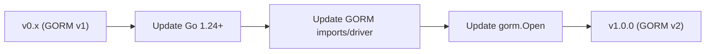

# Migration Guide: v0.x to v1.0.0

## Upgrading gormauthstore from v0.x (GORM v1) to v1.0.0 (GORM v2)

**Date:** February 7, 2026
**Audience:** Developers upgrading from the original `sqrldev/server-go-ssp-gormauthstore`

---

## Overview

v1.0.0 is a major upgrade that migrates from the deprecated GORM v1
(`github.com/jinzhu/gorm`) to GORM v2 (`gorm.io/gorm`). The `ssp.AuthStore`
interface contract is preserved -- all three methods (`FindIdentity`,
`SaveIdentity`, `DeleteIdentity`) retain their original signatures.



### What Changed

| Area | v0.x (GORM v1) | v1.0.0 (GORM v2) |
|------|----------------|-------------------|
| **GORM** | `github.com/jinzhu/gorm` v1.9.16 | `gorm.io/gorm` v1.31.1 |
| **Go version** | 1.13+ | 1.24+ |
| **Database drivers** | Bundled in GORM v1 | Separate packages (`gorm.io/driver/*`) |
| **Connection API** | `gorm.Open("postgres", dsn)` | `gorm.Open(postgres.Open(dsn), &gorm.Config{})` |
| **Error handling** | `gorm.IsRecordNotFoundError(err)` | `errors.Is(err, gorm.ErrRecordNotFound)` |
| **Input validation** | None | `ValidateIdk()` on all operations |
| **Secure memory** | None | `ClearIdentity()`, `SecureIdentityWrapper` |
| **Context support** | None | `*WithContext()` methods |

### What Did NOT Change

- `ssp.AuthStore` interface (same 3 method signatures)
- Database table name (`sqrl_identities`)
- Database column names and types
- `NewAuthStore(db)` constructor
- `AutoMigrate()` method

---

## Step-by-Step Migration

### Step 1: Update Go Version

v1.0.0 requires Go 1.24 or later:

```bash
go install golang.org/dl/go1.24.7@latest
go1.24.7 download
```

### Step 2: Update Imports

Replace the GORM v1 import with GORM v2 and the appropriate database driver:

```go
// BEFORE (v0.x)
import (
    "github.com/jinzhu/gorm"
    _ "github.com/jinzhu/gorm/dialects/postgres"
)

// AFTER (v1.0.0)
import (
    "gorm.io/gorm"
    "gorm.io/driver/postgres"   // or mysql, sqlite, sqlserver
)
```

### Step 3: Update Database Connection

```go
// BEFORE (v0.x)
db, err := gorm.Open("postgres", dsn)

// AFTER (v1.0.0)
db, err := gorm.Open(postgres.Open(dsn), &gorm.Config{})
```

**Driver-specific imports:**

| Database | v0.x Dialect | v1.0.0 Driver |
|----------|-------------|---------------|
| PostgreSQL | `github.com/jinzhu/gorm/dialects/postgres` | `gorm.io/driver/postgres` |
| MySQL | `github.com/jinzhu/gorm/dialects/mysql` | `gorm.io/driver/mysql` |
| SQLite | `github.com/jinzhu/gorm/dialects/sqlite` | `gorm.io/driver/sqlite` |
| SQL Server | `github.com/jinzhu/gorm/dialects/mssql` | `gorm.io/driver/sqlserver` |

### Step 4: Update go.mod

```bash
# Remove GORM v1
go get -u github.com/sqrldev/server-go-ssp-gormauthstore@v1.0.0

# Add the database driver you need
go get gorm.io/driver/postgres   # or mysql, sqlite, sqlserver

# Clean up
go mod tidy
```

### Step 5: Update Error Handling (if using directly)

If your code checks for GORM errors directly (not through the AuthStore
interface), update the error check pattern:

```go
// BEFORE (v0.x)
if gorm.IsRecordNotFoundError(err) {
    // handle not found
}

// AFTER (v1.0.0)
if errors.Is(err, gorm.ErrRecordNotFound) {
    // handle not found
}
```

> **Note:** If you only use `FindIdentity`, `SaveIdentity`, and
> `DeleteIdentity`, no error handling changes are needed. The AuthStore
> already maps `gorm.ErrRecordNotFound` to `ssp.ErrNotFound`.

### Step 6: Adopt Context Support (Optional)

v1.0.0 adds context-aware methods for timeout and cancellation:

```go
// BEFORE (v0.x) - still works in v1.0.0
identity, err := store.FindIdentity(idk)

// AFTER (v1.0.0) - optional, recommended for production
ctx, cancel := context.WithTimeout(r.Context(), 5*time.Second)
defer cancel()
identity, err := store.FindIdentityWithContext(ctx, idk)
```

### Step 7: Adopt Secure Memory (Optional)

v1.0.0 provides secure cleanup of sensitive cryptographic material:

```go
// Option A: Manual cleanup
identity, err := store.FindIdentity(idk)
if err != nil { return err }
defer gormauthstore.ClearIdentity(identity)

// Option B: Wrapper with automatic cleanup
wrapper, err := store.FindIdentitySecure(idk)
if err != nil { return err }
defer wrapper.Destroy()
identity := wrapper.GetIdentity()
```

---

## Database Migration

### Schema Compatibility

The database schema is **fully compatible** between v0.x and v1.0.0. No
database migration is required.

| Column | v0.x Type | v1.0.0 Type | Change |
|--------|-----------|-------------|--------|
| `idk` | `TEXT PRIMARY KEY` | `TEXT PRIMARY KEY` | None |
| `suk` | `TEXT` | `TEXT` | None |
| `vuk` | `TEXT` | `TEXT` | None |
| `pidk` | `TEXT` | `TEXT` | None |
| `sqrl_only` | `BOOLEAN` | `BOOLEAN` | None |
| `hardlock` | `BOOLEAN` | `BOOLEAN` | None |
| `disabled` | `BOOLEAN` | `BOOLEAN` | None |
| `rekeyed` | `TEXT` | `TEXT` | None |
| `btn` | `INTEGER` | `INTEGER` | None |

### Rollback

If you need to roll back to v0.x, no database changes are needed. Simply
revert the Go code and dependencies.

---

## New Features in v1.0.0

### Input Validation

All AuthStore methods now validate the identity key before database
operations:

- Empty key: returns `ErrEmptyIdentityKey`
- Key > 256 characters: returns `ErrIdentityKeyTooLong`
- Invalid characters: returns `ErrInvalidIdentityKeyFormat`
- Nil identity: returns `ErrNilIdentity`

### Context-Aware Methods

| Original Method | Context Variant |
|----------------|-----------------|
| `FindIdentity(idk)` | `FindIdentityWithContext(ctx, idk)` |
| `SaveIdentity(identity)` | `SaveIdentityWithContext(ctx, identity)` |
| `DeleteIdentity(idk)` | `DeleteIdentityWithContext(ctx, idk)` |
| `FindIdentitySecure(idk)` | `FindIdentitySecureWithContext(ctx, idk)` |
| `AutoMigrate()` | `AutoMigrateWithContext(ctx)` |

### Secure Memory Clearing

- `ClearIdentity(identity)` -- wipes all sensitive string fields
- `WipeBytes(b)` / `WipeString(s)` -- platform-aware memory clearing
- `SecureIdentityWrapper` -- RAII-style auto-cleanup via `Destroy()`

---

## Troubleshooting

### "cannot use store as ssp.AuthStore"

Ensure you are importing the correct ssp package. The AuthStore interface
has not changed:

```go
import ssp "github.com/sqrldev/server-go-ssp"
```

### "unknown driver" or "dialect not found"

GORM v2 requires separate driver packages. Install the driver for your
database:

```bash
go get gorm.io/driver/postgres
```

### "go.mod: go 1.24 requires newer version"

v1.0.0 requires Go 1.24+. Update your Go installation.

---

**Document Control:**

- Version: 1.0
- Date: February 7, 2026
